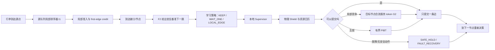

# G4IRSF17：面向真实机场连续行李流的去中心化学习控制主线

> **定位**：G4IRSF16 已经把“能不能安全运行”解决得相当扎实；G4IRSF17 不再以继续补检查、补哈希、补封存为主，而要把主要计算和开发预算用于回答一个更重要的问题：**在不恢复全局 A*、不恢复完整未来路线预约的前提下，怎样让局部学习控制真正降低行李总处理时间，并在更高流量与故障场景下保持可扩展性。**

---

## 0. 当前冻结基线

- Repository：`czr5454112-glitch/jichang_origin`
- PR：`#1 G4IRSF16: fail-closed local supervisor and causal no-go evidence`
- Base branch：`codex/g4irsf15-execution`
- Head branch：`codex/g4irsf16-execution`
- Frozen head SHA：`87de2da583aea8664d2ea219e1ab0629c0c3e590`
- 当前 PR 状态：Open、Draft、可合并、无冲突
- 当前正式默认：`F2/H0/R0`
- 当前学习闭环结论：`CAUSAL_LEARNING_NO_GO_WITH_ACTIONABLE_PIVOT`
- 下一正式证据目标：`I1_SOURCE_ORDERING`

G4IRSF17 应从上述 SHA 创建**新的独立分支/工作树**，不得覆盖、重写或“修正”G4IRSF16 的既有证据。建议分支：

```text
codex/g4irsf17-execution
```

PR #1 暂时保留为工程与负面科学结果的里程碑；本轮不得自动合并或改写其结论。

---

# 1. 先给结论：现在的结果究竟是好是坏

## 1.1 工程结果是明显的好消息

新框架已经证明以下事情能够同时成立：

1. 每件行李在接口处只做一跳决定；
2. 不保存完整未来路线；
3. 不扫描全局预约表；
4. 不调用完整 A*/CIE；
5. 具备本地 supervisor、物理 shield、局部 PIBT、故障代际和安全等待；
6. 能在原始完整规模上完成 28,506 件行李、43,603 个 segment、522,871 次节点决策；
7. 全规模 shadow 中没有非法动作、冲突、未来路线读取或全局扫描。

这不是“只搭了一个空架子”。它已经是一个可运行的、真正一步式的去中心化控制底座。

## 1.2 性能结果目前是明确的 no-go，但不是方向失败

G4IRSF16 的 H5 诊断候选在 8,192 规模上：

- 网络内时间改善约 `0.058518 s/袋`；
- 源端等待增加约 `0.149551 s/袋`；
- 最终净结果变慢约 `0.091033 s/袋`；
- P95、P99 没有恶化；
- 141 件改善、297 件退化、7,754 件不变。

因此 H5 不应上线，学习闭环继续关闭是正确决定。

但这个结果同时给出了非常有价值的方向：**当前主要损失不是行李进入系统后走得太慢，而是局部动作改变了下游占用节奏，反过来让更多行李在源头排队。**

也就是说，新框架已经能把“路上怎么走”做得不差；下一步必须补上的是“谁先进入、谁先通过合流口、什么时候只等一个服务机会”的局部流量控制能力。

## 1.3 正确定位

当前项目不是：

```text
去中心化策略已失败
```

而是：

```text
安全的一步式去中心化运行框架已成功；
旧框架隐藏的中央排序与未来预约能力尚未被局部智能完全替代；
冻结旧 G4E 评分器也还没有针对新事件框架重新训练。
```

G4IRSF17 的任务就是填补这部分“局部协调成本”。

---

# 2. 本项目不可改变的主线

## 2.1 最终目标

在真实机场固定拓扑上，让每件行李在每个传送带接口处依据**严格有界的局部信息**决定：

```text
走哪一条合法相邻边；
是否等待一个自然服务机会；
源队列中哪件行李先进入；
合流节点下一次服务哪一个本地请求。
```

从而替换原始项目中的完整 A*/HCA* 路径规划，并使系统更适合：

- 连续到达的行李流；
- 更大任务规模；
- 局部拥堵；
- 设备故障与恢复；
- 按节点或区域并行部署。

## 2.2 不得退回的旧式能力

最终候选不得重新引入：

- 完整全局 A*、HCA*、CIE；
- 为每件行李预先生成到终点的完整路线；
- 全局未来预约表扫描；
- 无界多跳通信；
- 运行时读取整个机场所有队列；
- 依赖未来完整任务日的非因果特征；
- 用节点 ID、任务 ID 或巨型 codebook 记忆答案；
- 以“只在 shadow 中评分”冒充闭环性能提升。

## 2.3 可以保留并应该保留的东西

去中心化不等于没有规则，也不等于把安全全交给神经网络。允许并鼓励：

- F2 作为可靠默认动作；
- 学习模型只在有把握时覆盖 F2；
- 节点本地的源队列排序；
- 节点本地的合流服务 token；
- 固定深度、固定扩展数的局部 PIBT；
- 物理 shield；
- 故障代际、TTL 故障广播；
- 安全等待、局部重试和人工告警终态；
- 只在极端长尾触发的固定上限局部微型回退。

这些机制不是“又变回中心化”，因为它们都只看当前节点、邻接节点和有界队列。

---

# 3. 从原始论文借什么，不借什么

原始 IoT-DRPA 的有效性并不只来自 HCA*。其框架还包含：

1. 根据到达、起飞和等待时间统一排序任务；
2. 使用 BTI 跟踪行李位置；
3. 使用 DDI 感知设备中断；
4. 中断后更新可用图、识别受影响任务并重新规划；
5. HCA* 完整路径搜索和全局预约表。

G4IRSF17 应当进行“思想迁移”，而不是“代码照搬”：

| 原论文能力 | 新框架中的去中心化对应物 | 是否保留中央全局机制 |
|---|---|---:|
| 统一任务优先级 | 每个源队列内部的局部排序 | 否 |
| 全局预约表 | 目标节点本地服务 token、短时 incoming ETA 摘要 | 否 |
| BTI 行李跟踪 | 当前节点/segment/generation 的事件状态 | 否 |
| DDI 故障处理 | 物理 shield + 故障代际 + TTL 局部广播 | 否 |
| 故障后完整重规划 | 每到一个节点重新选择一跳；无路则本地 hold/PIBT | 否 |
| HCA* 搜索 | F2 + 学习覆盖 + 有界局部保底 | 否 |

最值得优先借鉴的是**优先级与故障思想**。最不应该复制的是**中央完整路线与全局预约**。

---

# 4. 目标控制架构



需要形成四个互补层次：

1. **行李级路径策略**：决定下一条边；
2. **源点局部排序**：决定本源队列哪件先进入；
3. **合流节点局部调度**：决定本节点下一次服务哪个请求；
4. **安全与长尾保底**：shield、PIBT、故障 hold/retry。

学习仍然是主角，但不要求学习模型独自承担全部物理安全和极端长尾。

---

# 5. 本轮优先级

## 第一优先：定位并解决源端等待增加

当前唯一明确的净损失来源是 `source wait +0.149551 s/袋`。因此先做 I1 是合理的，而且现有运行时已经具备：

- source queue generation；
- FIFO/aging 选择入口；
- `causal_i1_swap_selected`；
- `process_source_arbitration`；
- 源队列前后长度与 generation 追踪。

这意味着本轮可以直接做真实因果干预，而不是再搭几周基础设施。

但是必须先回答一个更深的问题：

> 源头等待真的是“源队列顺序选错了”，还是下游合流口堵住以后，源头只是被动背压？

如果是前者，I1 可以直接改善；如果是后者，只换源队列顺序可能只是换一件行李受苦，无法提高总吞吐量。因此 G4IRSF17 必须先做**等待原因归因**，并设置向 G2 合流调度的明确转向条件。

## 第二优先：为新事件框架重新训练策略

F2 的评分核心来自旧 G4E。它在旧的中央预约环境下训练，放到新的一步事件框架里只是一个很强的安全起点，不应永远作为最终大脑。

新策略至少要学会：

- 什么时候保持 F2；
- 哪件行李应先从同一源进入；
- 等一个服务机会是否比立即移动更好；
- 当前节省的时间是否会把成本推给其他行李；
- 在高流量下如何减少合流波峰。

## 第三优先：把故障机制做成真正的 native 运行实验

G4IRSF16 已有 supervisor 层的确定性故障契约，但报告也明确说明：它还不是完整 native runtime 故障实验，也没有证明故障场景 TTH 改善。

因此故障工作应并行推进，但不应压过 I1/G2 性能主线。

## 第四优先：做规模与计算性能基准，再按 profiling 优化代码

当前 `+0.091 s/袋` 是模拟中的业务等待，不是 C++ 运行慢。盲目优化代码不会自动消除它。

代码优化应以 profiling 为依据，重点证明：

- 1×/2×/4×/8×/16× 下的 wall time；
- decisions/s；
- event/s；
- peak RSS；
- 每个节点局部队列上界；
- 与旧 HCA/旧 v2-safe 同机对比；
- 旧算法在高流量下若超时，应按 censored result 诚实报告。

---

# 6. G4IRSF17 分阶段执行计划

## Phase 0：冻结基线并建立真实 campaign，不重复做大规模行政检查

### 工作

1. 从 `87de2da...` 创建独立 worktree 和 `codex/g4irsf17-execution`；
2. 运行一次最小基线回归，确认现有二进制和关键测试可运行；
3. 将 G16 artifact 设为只读输入，不重算历史 64 shards；
4. 创建：

```text
artifacts/manifests/g4irsf17_campaign_manifest.json
outputs/reports/g4irsf17_campaign_log.md
```

5. campaign manifest 记录阶段、实验、完成状态、停止条件和结论，不把哈希本身当作科学结论。

### 预算约束

- 基线、哈希、provenance、格式检查合计不超过本轮开发/运行预算的 10%；
- CI 与回归是必要门禁，但不能成为本轮主要交付物。

### 完成标准

- 新分支可构建；
- 关键 G16 回归仍通过；
- 开始进入真实代码修改和实验，不得在此阶段宣布完成。

---

## Phase A：把“为什么源头多等了 0.1496 秒”拆开

### 核心问题

每次源队列未能放行时，必须记录一个**明确、互斥、可归因的原因**：

```text
A1：源点本身的服务时间未到；
A2：first-edge credit 不可用；
A3：目标节点队列/容量满；
A4：目标节点合流 token 被其他入口占用；
A5：真实故障/故障代际阻断；
A6：supervisor 主动 WAIT；
A7：PIBT 或恢复事务占用；
A8：其他已定义原因。
```

不能只记录“blocked=true”。

### 新增离线诊断

对 matched E4/off 与 H5 candidate 做相同归因，输出：

- 每类原因的总等待秒数；
- 每件 raw bag 平均贡献；
- 按 source node、目标节点、小时、leg 类型分层；
- top-10 造成新增等待的节点/时间窗；
- 新增 source wait 是否集中在少数下游 merge；
- H5 改善网络时间与增加源等待是否发生在同一批袋或不同袋；
- 额外等待传播到多少其他行李。

### 关键输出

```text
outputs/tables/g4irsf17_source_wait_cause_ledger.csv
outputs/tables/g4irsf17_source_wait_topology_attribution.csv
outputs/reports/g4irsf17_source_wait_diagnosis.md
```

### 决策门

- 若至少 50% 的新增 source wait 可由本源队列顺序改变直接影响：继续 I1；
- 若至少 50% 集中于目标节点容量/merge token：I1 仍做 pilot，但立即并行启动 G2；
- 若原因无法由现有日志区分：先补最小 telemetry，禁止凭直觉训练。

这里的 50% 是方向判断阈值，不是论文显著性阈值；报告必须给出完整分布。

---

## Phase B：I1 源队列顺序的因果机会普查

### 干预定义

只在同一源队列内、同一自然放行机会下比较：

```text
基准：按当前 F2/Q0/FIFO-or-aging 选择第一件；
干预：在 top-K 合法候选中选择另一件先放行；
其余资源语义、事件顺序和随机种子完全一致。
```

优先从 `K=2` 开始；只有证据支持后才扩到 `K=4`。不得扫描整个机场任务列表。

### Pilot

- 首轮 64–128 个机会；
- 必须覆盖多个 source、小时、queue length、leg 类型和 slack 区间；
- 不允许全来自同一个高峰窗口；
- 每个机会记录当前袋效果和其他袋外部性。

### 自适应扩展

满足以下任一条件则扩到 512，再视情况扩到 1,024：

- 有益 I1 样本达到训练支持门槛；
- 置信区间仍跨零但效果分层明显；
- 某些 source/time bucket 有强信号；
- 学习状态混叠诊断显示需要更多覆盖。

若 128 个机会全部接近零，不得立刻结题；先确认机会选择是否只采到了无竞争状态。若竞争状态覆盖充分且扩到 512 后仍无信号，再正式转向 G2。

### 标签

对每个候选顺序计算：

- 当前 raw bag 总 TTH 差；
- source wait 差；
- network time 差；
- 其他 bag 总影响、最大伤害、CVaR95；
- P95/P99 归属；
- deadline miss；
- 是否仅把等待从一件袋转移给另一件；
- 系统总完成时间和局部 drain time。

### 目标支持门

建议最低可训练支持：

- train/calibration/validation 中有益样本至少 `32/8/8`；
- harmful 样本足以训练风险 veto；
- 至少覆盖 3 个 source、3 个小时段和 2 类 leg；
- 不满足时继续采样或宣布 I1 support no-go，不允许靠阈值调参伪造支持。

---

## Phase C：构建真正针对新框架的局部观测

### 当前 29 维的定位

当前 29 维适合安全的一跳干预，但缺少以下关键时序信息：

- 本源队列中“谁在前、谁更急”；
- 队列正在变长还是正在消退；
- 最近短时间进入了多少袋；
- 下游节点的服务速度；
- 合流请求是否正在积累；
- 距离下一次服务 token 还有多久；
- 两个看起来一样的队列，一个可能马上疏通，另一个可能继续恶化。

### 最小新增特征

所有新增输入必须严格局部、有固定上界、运行时真实可得：

#### Source-front 特征

- 当前候选在源队列的局部 rank；
- top-K 候选的 `deadline slack`、`wait age`、leg 类型差值；
- source queue length/capacity；
- source queue generation；
- 最近 10/30/60 秒 release count；
- 最近 10/30/60 秒 admission count；
- queue slope = arrivals - admissions；
- 当前 first-edge-credit slack。

#### 下游背压特征

- 目标 queue/capacity；
- 目标 scheduled incoming；
- 最近服务率；
- 最近 drain slope；
- service-weighted pressure；
- 一跳/二跳有 TTL 的压力摘要；
- 不得读取全局未来预约。

#### Merge 特征

- pending request count；
- oldest request age；
- 当前 token generation；
- 距离下一 service opportunity；
- 各入边最近服务次数；
- 本候选与当前获准候选的 urgency/wait 差。

### 优先复用现有 native 字段

`EventCandidateRecord` 已经包含多项比 G16 模型实际使用的 29 维更丰富的局部量，例如：

- goal-conditioned queue length / max wait；
- target scheduled incoming；
- estimated service rate；
- first-edge-credit slack；
- alternative margin；
- service-weighted pressure；
- two-hop queue pressure；
- candidate score rank。

优先统一这些字段的训练/运行时语义，避免另造一套相似但不一致的 proxy。

### 状态充分性测试

必须新增“状态混叠”实验：

1. 在旧 29 维空间寻找近邻状态；
2. 检查近邻状态的真实反事实收益是否方向相反；
3. 计算条件方差、符号冲突率；
4. 加入 source/merge 时序特征后重复；
5. 只有新特征显著降低混叠，才进入模型。

输出：

```text
outputs/reports/g4irsf17_state_aliasing_audit.md
outputs/tables/g4irsf17_feature_ablation.csv
```

---

## Phase D：I1 模型与规则必须并行比较

不要只训练一个模型，也不要只试一个手写规则。至少比较四类候选。

### D0：现有基准

- FIFO；
- 当前 aging/Q0；
- F2/H0/R0 matched E4/off。

### D1：原论文思想的局部优先级规则

仅在一个 source queue 内使用：

- departure/deadline slack；
- arrival/release time；
- current wait age；
- storage/direct leg；
- repair priority；
- bounded aging，防止饥饿。

应检查原始 Java/论文中的真实优先级定义，而不是凭印象写公式。输出一个清晰、可审计的本地化版本。

### D2：线性或 pairwise ranker

输入两个候选之间的局部特征差，预测“谁先放行的系统收益更好”。优点是容易解释、推理快、适合初步因果支持。

### D3：小型 MLP/listwise ranker

- top-K 固定为 2 或 4；
- 模型规模小；
- 不使用 ID；
- 输出连续 score；
- 通过 mask 只在合法候选中选择；
- 不得退化为 source/time codebook。

### D4：保守选择器

模型不直接无条件接管，而是：

```text
若 benefit lower bound > 0
且 harm upper bound < 风险阈值
且 OOD=false
且 supervisor 授权
则覆盖基准顺序；
否则保持 F2/Q0。
```

### 训练目标

优先学习系统级 advantage：

```text
当前 bag 收益
+ 邻近其他 bag 总收益
- 尾部伤害惩罚
- deadline 风险
```

不能只优化“当前袋进入得更快”，否则会重复 H5 把成本推给其他袋的问题。

### 模型门

- 使用 source/time/task-group 无泄漏切分；
- final audit 保持封存；
- 报告 calibration、OOD、beneficial precision/recall、harmful recall；
- 支持不足时 abstain，不得通过大范围调阈值强行激活。

---

## Phase E：闭环阶梯，不在第一个 canary 后停止

每个具有训练授权的 I1 候选至少运行：

```text
144 → 512 → 2,048 → 8,192 → full 43,603 segments
```

每一级必须有相同 E4 语义的 off control。

### 每级输出

- completed bags/segments；
- mean/p50/p95/p99 raw-bag original-entry TTH；
- source wait；
- network time；
- action/order changes；
- improved/degraded/unchanged bags；
- externality；
- queue peak；
- starvation；
- conflicts/unsafe/deadlocks；
- A*/global scan/future route counters；
- CPU、wall time、RSS。

### 硬门

任何级别出现以下情况立即回退候选，但 campaign 不停止，应分析并进入下一候选或 pivot：

- failed segment/bag；
- unsafe entry；
- conflict；
- unresolved deadlock；
- full A*/CIE；
- global reservation scan；
- future route storage/read；
- 非局部无界通信；
- success regression；
- p95/p99 明显恶化；
- 饥饿或单袋无限等待。

### 性能晋升门

建议正式晋升至少满足：

1. full 1× matched E4 mean TTH 优于 off；
2. 以 raw bag 或时间块 bootstrap，95% CI 上界小于 0；
3. p95、p99 不恶化；
4. source wait 与 network time 分解合理，不能靠把成本移到未统计部分；
5. 在至少两个高流量尺度仍保持改善或不退化；
6. 多个 source/time/leg bucket 改善，不是只记住一个局部时段；
7. 零安全与完成率回归。

小幅但稳定的改善可以晋级为下一阶段候选；不得把单个 144 或 512 canary 的偶然优势包装成最终胜利。

---

## Phase F：I1 不够时，立即进入 G2 本地合流调度

### 为什么 G2 很可能重要

源头等待增加可能只是下游合流拥堵的表现。旧 v2-safe 的未来预约实际上提前决定了“谁先过合流口”。新框架目前只靠局部资源日历和少量 PIBT，普通合流顺序仍较粗糙。

### G2 设计

每个目标节点维护一个固定上界的 pending merge queue，只看：

- 本节点请求；
- 相邻入边；
- 当前资源日历；
- 请求等待年龄；
- 行李 urgency/slack；
- 局部 downstream pressure；
- token generation。

动作是：

```text
在下一自然服务机会中，给哪个本地 pending request 发 token。
```

不是：

```text
为全机场所有行李排全局顺序。
```

### G2 因果门

先做 64–128 个 merge service opportunity pilot；若有益机会集中，扩到 512。比较：

- FIFO merge；
- oldest-first；
- urgency-first；
- balanced incoming fairness；
- pairwise learned grant；
- selective learned override。

### I1/G2 联合控制

只有单独 I1、单独 G2 都通过基本门后，才运行联合候选：

```text
I1 source ordering + G2 merge token + F2 path selection
```

避免一开始同时改多层，导致无法判断性能来自哪里。

---

## Phase G：真正的 native 故障与恢复实验

### 已有基础

当前 supervisor 已证明：

- 物理 shield 可阻止故障边；
- stale generation 会被拒绝；
- repair 后可重新进入正常决策；
- PIBT 事务在故障时可原子中止；
- full A* 请求会被拒绝。

但这些是 supervisor contract 级别测试，不等于完整事件运行时故障实验。

### 新框架的故障机制

1. 设备或边发生故障；
2. shield 立即禁止真实故障资源；
3. fault generation 增长；
4. 只向相关相邻节点传播带 TTL 的故障 beacon；
5. 已到接口的行李重新枚举合法一跳；
6. 有替代边时由 F2/学习策略选择；
7. 无替代边时 SAFE_HOLD；
8. 局部互锁时 bounded PIBT；
9. repair 后 generation 更新并重新决策；
10. 受阻行李可获得一次 bounded repair-priority，随后清除，避免永久抢占。

### Native fault matrix

至少覆盖：

- 单条非关键边故障；
- 单条关键瓶颈边故障；
- merge 节点/入边故障；
- source first edge 故障；
- EBS 相关边故障；
- 两个互不相邻故障；
- 两个存在传播关系的故障；
- delayed beacon；
- dropped intermediate beacon；
- repair 后 reopening；
- 高流量 1×/4×，资源允许时 8×。

### 对照

- 新框架 F2/off；
- 新框架 learned candidate；
- 无故障基准；
- 原论文静态/动态机制只作历史背景，除非能同机 fresh rerun。

### 输出

- completion；
- unsafe/conflict；
- stranded bags；
- recovery time；
- TTH mean/p95/p99；
- fault-affected bag success；
- route changes；
- beacon traffic；
- local hold duration；
- A* 调用仍为 0。

故障机制应是论文中的第二条贡献，但不应取代去中心化学习性能主线。

---

## Phase H：规模、吞吐与代码优化

### 规模矩阵

地图保持不变，任务生成规则沿用已验证协议：

```text
1× full
2× full
4× full
8× full
16× full
32× smoke（资源允许时）
rolling 2-day / 7-day（已有协议可复用）
```

### 对比对象

- legacy HCA/Java（能运行到哪里就报告到哪里）；
- old v2-safe；
- new F2/off；
- G17 deterministic local control；
- G17 learned selective control。

严格区分：

```text
业务性能：TTH、等待、完成率；
计算性能：wall time、CPU、RSS、events/s、decisions/s。
```

### Profiling 后再优化

只优化实际热点，例如：

- event priority queue；
- candidate record 构造；
- tiny-model inference；
- merge request bookkeeping；
- bounded trace logging；
- repeated map/static-potential lookup；
- memory allocation。

每个优化必须提供：

- profiler 前后证据；
- 语义 parity；
- 性能增益；
- 无安全回归。

禁止为了“看起来做了优化”重写大量代码而不做 benchmark。

---

## Phase I：长尾保底层

学习策略解决高频正常状态；极端长尾由确定性机制保证安全和终止。这是实际系统需要的设计，不是失败。

建议固定层级：

```text
L0  F2 安全默认下一跳
L1  学习选择性覆盖：KEEP / WAIT_ONE / LOCAL_EDGE
L2  本源队列/本 merge 的确定性公平与 urgency 规则
L3  bounded local PIBT
L4  fault-aware SAFE_HOLD + local retry
L5  可选固定深度/固定扩展数的局部 escape rollout
L6  隔离、告警、人工处理终态
```

### 对 L5 的限制

只有在真实长尾证据表明 L3/L4 不足时才允许开发，并必须满足：

- 固定深度，例如 2–3 hop；
- 固定最大展开数；
- 不生成到终点路线；
- 不读取全局任务；
- 不写入未来全局预约；
- 只作为极低频恢复机制；
- 单独报告触发率与成本。

不得把它悄悄扩展成新的 A*。

---

# 7. 学习方法的建议形态

## 7.1 不建议一开始直接做大规模在线强化学习

当前已经有可靠 F2 行为策略和可做成对因果干预的运行时。更稳妥路线是：

1. 用 paired counterfactual 获取局部动作真实系统效果；
2. 训练小型 advantage/risk 模型；
3. 只在高置信度状态覆盖 F2；
4. 闭环采集新分布；
5. 再做迭代式数据扩充。

这比让一个未经约束的 RL 模型直接控制整个机场更容易验证，也更符合安全系统。

## 7.2 可以形成多头但共享表示的局部策略

最终模型可以共享一套局部状态编码，再有三个动作头：

```text
source head：同一源队列谁先进入；
route head：下一条合法邻接边；
hold head：是否等待一个自然服务机会；
```

merge token 可以先作为单独模型，证据成熟后再共享编码。

## 7.3 模型不应被要求解决物理安全

模型输出的是建议，不是最终动作。Supervisor 与 shield 负责：

- 动作是否合法；
- 资源是否可用；
- 故障是否真实存在；
- token/generation 是否过期；
- 是否发生振荡；
- 是否已经用过一次 hold/override；
- 是否需要安全回退。

---

# 8. 关键科学问题与必须回答的分析

G4IRSF17 最终报告至少回答：

1. H5 为什么减少 network time 却增加 source wait？
2. 新增 source wait 主要来自本地源排序，还是下游 merge/capacity 背压？
3. I1 中真正有益的状态占比是多少，集中在哪些 source/time/load？
4. 当前 29 维为何无法分辨部分状态？新增局部时序特征是否降低状态混叠？
5. 简单局部优先级、线性 ranker、小 MLP 谁最稳？
6. 学习模型是否真的比一个合理的原论文式局部规则更好？
7. 学习策略的收益来自哪些动作，伤害来自哪些动作？
8. I1 与 G2 是否互补，还是会互相抵消？
9. 在 2×/4×/8×/16× 下，业务 TTH 和计算性能如何变化？
10. 故障发生时，新框架能否不使用 A* 完成恢复？
11. 长尾保底触发率是多少，是否仍保持严格局部和固定上界？
12. 新框架相对旧 HCA 的核心胜点究竟是 TTH、计算可扩展性、故障恢复，还是三者组合？

---

# 9. 晋升、停止与转向规则

## 9.1 I1 继续条件

继续扩大 I1，当且仅当：

- 有益机会达到支持门；
- 或效果在明确 bucket 内集中；
- 或当前不确定性主要来自样本不足而不是完全零效果。

## 9.2 I1 转向 G2 条件

满足任一条件即将主要预算转给 G2：

- 512 个有竞争的 I1 对中有益支持仍不足；
- I1 主要改变“谁等待”而不改变系统总等待；
- source wait 增量主要归因于 downstream merge/capacity；
- learned I1 不优于简单 deterministic rule；
- I1 在 8,192 或 full 规模产生明显外部性退化。

## 9.3 I3 路径改道的地位

G15 已显示随意 I3 改路成本很高。因此：

- 正常流量下不重新做大范围 I3 threshold sweep；
- I3 只在高置信度、明显拥堵或故障绕行状态研究；
- 必须限制路径增长和循环；
- 若无新的局部状态或新故障场景，不得重复旧 I3 实验。

## 9.4 学习无法稳定获益时

如果经过 I1、G2、状态补充和至少三类模型后，学习仍无稳定增益：

- 保留最好的 deterministic local scheduler；
- 学习模型退为风险识别/何时采用规则的选择器；
- F2 继续做默认路径策略；
- 把论文贡献重点放在一步事件框架、严格局部安全、可扩展性和故障恢复；
- 但必须诚实说明 learning 的性能边界。

这比强行上线一个有害模型更有科学价值。

---

# 10. 实验资源分配建议

```text
60–65%：I1/source wait 归因、数据采集、学习策略、闭环阶梯
15–20%：G2 本地 merge/service-token 因果实验
10–15%：native 故障与恢复
10–15%：高流量 benchmark、profiling、必要代码优化
≤10%：哈希、封存、格式、行政检查
```

这些比例可随证据调整，但不得让 provenance 工作重新成为主任务。

---

# 11. 必须生成的实质性交付物

## 11.1 代码

至少应出现真实实现，而不只是报告：

- source wait reason telemetry；
- source-front local observation；
- bounded temporal counters/ring buffers；
- I1 causal runner；
- I1 rule baselines；
- I1 learned ranker；
- selective authorization path；
- matched closed-loop ladder；
- G2 pilot（若触发）；
- native fault runner；
- scale benchmark/profiler harness。

## 11.2 数据与模型

```text
artifacts/datasets/g4irsf17_i1_*.{jsonl,zst,parquet}
artifacts/models/g4irsf17_i1_*.json
artifacts/policies/g4irsf17_*.json
artifacts/gates/g4irsf17_*.json
```

## 11.3 报告

```text
outputs/reports/g4irsf17_source_wait_diagnosis.md
outputs/reports/g4irsf17_i1_causal_support.md
outputs/reports/g4irsf17_state_aliasing_audit.md
outputs/reports/g4irsf17_i1_model_decision.md
outputs/reports/g4irsf17_closed_loop_ladder.md
outputs/reports/g4irsf17_g2_decision.md
outputs/reports/g4irsf17_native_fault_campaign.md
outputs/reports/g4irsf17_scale_benchmark.md
outputs/reports/g4irsf17_final_joint_decision.md
```

## 11.4 图表

至少包括：

- source wait 原因堆叠图；
- 新增等待的节点/时间热力图；
- I1 反事实收益分布；
- beneficial/harmful coverage；
- feature aliasing 前后对比；
- mean/p95/p99 ladder；
- source wait vs network time 分解；
- load scale vs TTH；
- load scale vs wall time/RSS；
- fault onset/repair 时间线。

---

# 12. 禁止“快速完成”的方式

以下不算完成 G4IRSF17：

- 只检查 PR、CI、hash、文件存在性；
- 只重新跑 G16 回归；
- 只生成一个设计文档；
- 只做 64 个 pilot，看到不显著就结束；
- 只训练一个模型；
- 只报告 shadow；
- 只跑 144/512 canary；
- 用不同 E0/E4 语义比较后宣称胜利；
- 把 network time 改善但 source wait 恶化包装成总性能提升；
- 用高流量 smoke 替代 full；
- 因为学习没赢就重新加入全局 A*；
- 因为某个候选失败就停止整个 campaign；
- 为了产生“好数字”修改地图、任务生成规则或指标分母。

正确的终止方式只有：

1. 候选通过完整晋升门；或
2. 对 I1/G2/特征/模型族完成足够证据后形成明确 no-go 与下一科学方向；或
3. 真实工程/计算资源阻断，并给出可复现的阻断证据。

---

# 13. 最终成功可以分为四个层次

## Level A：框架成功

- 原始 full 与高流量均安全完成；
- 零 A*、零全局扫描、零未来路线；
- 故障可恢复。

G16 已完成大部分，G17 应补 native fault 与高流量计算证明。

## Level B：局部调度不退化

- I1/G2 至少不再造成 source wait 净损失；
- full 1× mean、P95、P99 不退化。

## Level C：学习获得稳定业务收益

- matched E4 full 1× 有统计支持的 TTH 改善；
- 至少两个更高流量尺度不退化或继续改善；
- 不依赖 ID/codebook；
- 低触发、可解释、外部性受控。

## Level D：论文级整体优势

- 在 1× 上接近或超过 v2-safe；
- 在 4×/8×/16× 上表现出更好的完成能力或计算扩展性；
- 故障下显著优于静态/无恢复对照；
- 提供“局部学习 + 本地协调 + 有界保底”的完整方法论。

即使最终只达到 B + 强计算扩展性 + 强故障恢复，也可能构成有价值的工程与学术结果；但不得虚构 C。

---

## 13.1 经验证的容量截断协议修订（2026-08-06）

4× fixed-map E4/off no-fault control 在冻结的 20,000,000 event 上限内仅完成 10,093/174,412 segments，因此原始 4× fault matrix 不具备可完成的 matched control。Phase G 明确修订为：

- 1× control + 十类 fault matrix 保持完整；
- 4× no-fault control 复用 exact-equivalent scale evidence，状态为 `CAPACITY_CENSORED_BY_EQUIVALENT_CONTROL` / `EVIDENCE_REUSED`；
- 十类 4× fault treatment 保留计划行，但状态为 `NOT_RUN_CONTROL_CENSORED`，不执行、不评价、不计 pass/fail，也不生成伪 result JSON；
- Phase-G track 可诚实终态化为 `TERMINAL_WITH_CAPACITY_CENSORING`，但 `original_4x_matrix_complete=false` 且 `fault_advantage_4x=NOT_ESTIMABLE`；
- 8×/16× scale 已各完成一次真实、有界的终态：两者都触发 20,000,000-event 上限并以 `HARD_GATE_FAILED` 结束，不从 4× 外推，也不将截断包装成扩展性胜利。

这一修订减少无法形成 matched 结论的重复计算，不改变地图、任务生成、分母或安全门。

## 13.2 最终容量边界与可执行转向（2026-08-06）

冻结的 fixed-map E4/off 基线在 1×、2× 完整结束，但在 4×、8×、16× 均触发 20,000,000-event 上限：

- 1×：43,603/43,603 segments，mean/P95/P99 TTH 为 217.583/270.054/330.601 s；
- 2×：87,206/87,206 segments，mean/P95/P99 TTH 为 1,388.006/7,967.049/11,684.048 s；
- 4×：10,093/174,412 segments，3,905.016 CPU s，2,328.844 MB peak RSS；
- 8×：11,123/348,824 segments，6,516.641 CPU s，2,990.547 MB peak RSS；
- 16×：14,127/697,648 segments，9,944.125 CPU s，5,174.641 MB peak RSS。

1×→2× 的 mean/P95/P99 TTH 分别放大 6.379×/29.502×/35.342×。新增 mean TTH 中 84.19% 来自 source wait；event 数放大 2.829×，CPU/event 放大 1.921×，合成总 CPU 放大 5.436×。因此当前主瓶颈不是全局寻路，而是 source admission/backlog、merge/service-slot 时序和 event bookkeeping 的联合作用。

16× 首次提供逐节点队列遥测：source queue peak 49,116、source queue delay peak 50,030.751 s、junction queue peak 32。由于 1×–8× 未提供同构逐节点字段，跨尺度 queue-peak bound 仍不可估计。16× 的 A*、全局扫描、未来路线读取/存储、非法冲突和 unsafe entry 计数保持为零，但完成率、event cap、饥饿与未解 deadlock 门失败；这证明局部性边界仍在，不能证明规模适应性已达标。

下一轮应保持 F2/H0/R0 与 fail-closed supervisor，不回退中央 A*；优先实现严格局部、bounded-pending 的 just-in-time service-slot arbitration，并同时对 source admission/backlog 和 event/merge bookkeeping 做有界优化。当前 eager token seam 的 M1–M6 评分无真实竞争机会，只是 seam-scoped no-support，不是整个 G2 方向的科学 no-go。

---

# 14. 一句话行动方向

> **继续主线，不退回中央 A*。先把 H5 暴露出的源端等待问题做成真实因果归因与 I1 学习排序；若等待实质来自下游合流，则迅速转入 G2 本地服务 token。与此同时，把原论文的优先级和故障思想改造成严格局部机制，并用 F2、shield、PIBT 和安全 hold 兜住学习策略无法覆盖的长尾。最后以 1×–16× 的业务与计算双重基准证明新框架确实更适合大规模机场连续行李流。**
