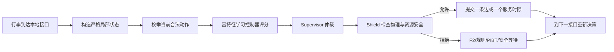

# G4IRSF18 主线方案：让富特征学习策略真正接管正常流量

> 基线提交：`1355dd68c9991de14c6429a945e492d1cc714426`
> 建议分支：`codex/g4irsf18-execution`
> 上游分支：`codex/g4irsf17-execution`
> 核心目标：在固定真实机场拓扑上，用严格局部、逐接口决策的学习策略替代正常流量中的 A* 全路径规划，并在更高任务流下保持安全、稳定和可扩展。
> 本阶段不是再建一套“检查框架”，而是必须让新策略在受控实验里真实改变正常流量动作。

---

## 0. 执行结论

G4IRSF17 的结果应定性为：

**工程与诊断上明显前进，正常流量算法上尚未过关，大规模能力仍被容量和事件膨胀卡住。**

它已经证明了以下重要事实：

1. 新事件驱动框架可以保持严格局部，不调用完整 A*，也不读取未来完整路线。
2. 真实在途故障 `(6,12)` 下，受影响的 23 件行李全部完成，未出现 stranded 或 unsafe。
3. 源端等待的主要增长并不只是“源队列排序错误”，而与下游 merge-token 背压高度相关。
4. G17 的 39 维局部状态已在代码中形成，但 I1 数据支持不足，模型没有获得正式授权。
5. 当前 eager G2 在请求刚到时就提前占住服务位置，因此没有形成真正的“多人竞争一个服务时隙”的决策机会。
6. 固定地图上 1×、2× 完成，4×、8×、16× 触发 20M event 上限，说明当前运行时在过载状态下会产生严重的事件和重试膨胀。

但 G17 **没有**证明：

- 学习策略已经替代 F2；
- 学习策略已经控制正常流量；
- 新策略优于 F2 或 v2-safe；
- 固定地图上的 4× 以上任务可以稳定完成；
- 当前 39D 模型可以直接切换为默认策略。

因此，G18 的约束性决定是：

> **不再把“训练了模型但未执行”视为主线完成。必须先创造真正的局部选择机会，再让富特征学习控制器在 research closed-loop 中实际选动作。F2 从默认主角降为教师、对照和保底。**

---

## 1. GitHub 当前状态与第一项必要修复

### 1.1 PR 状态

PR #2 当前是：

- Open；
- Draft；
- GitHub 判定 mergeable；
- head：`codex/g4irsf17-execution`；
- head SHA：`1355dd68c9991de14c6429a945e492d1cc714426`；
- base：`codex/g4irsf16-execution`。

但 GitHub Actions Run #55 **不是全绿**。Windows job 成功，Linux `gate-regressions` 失败。

### 1.2 真实失败原因

失败不是 runner 配额，也不是偶发安装问题。Native CTest 已通过 14/14；随后旧阶段兼容回归在以下位置失败：

```text
STAGE_E_SOURCE_CHECKOUT_DRIFT:
cpp/ics_core/runtime/destination_merge_grant.hpp
```

G17 修改了实际 merge runtime，而 G14 的封存验证仍把当前工作树中的该文件当作不可变化的 Stage-E 源文件。结果是大量旧测试在真正测试自己的目标之前，就被同一个 source drift 提前拦截。

### 1.3 正确修法

此问题必须修，但只能作为 G18 的短前置任务，不得吞掉整个阶段。

正确原则：

- 不重写、不重算、不“重新封存”G14/G15 的历史证据；
- 不删除失败测试；
- 不放宽断言；
- 不把当前 G18 文件伪装成旧 Stage-E 文件；
- 旧证据应在记录的历史 commit 或一次性 detached worktree 中验证；
- 当前 successor runtime 应由当前阶段自己的测试验证；
- 旧阶段和新阶段的身份边界必须分开。

时间约束：

- 最多一个专门提交；
- 最多半天；
- 修复后立即进入正常流量策略主线；
- 禁止顺势新建一大套 hash、manifest 或封存体系。

---

## 2. F2 到底是不是“很少特征的老策略”

### 2.1 需要纠正的认识

F2 确实较早，但它并不是一个只看两三个数的简单规则。

F2 是组合控制：

```text
S1/G4E 局部学习评分器
+ R3 本地资源日历
+ P2 严格局部 PIBT
+ Q0 优先级
+ 一跳提交
```

其中 G4E 模型本身使用 22 个输入，包括：

- 候选边到目标的静态剩余时间；
- 候选边传输和节点服务时间；
- 节点类型、出度、是否终点；
- 当前与候选节点压力；
- 候选节点下游 2 跳、3 跳压力；
- 瓶颈分数；
- 第二优选择差距；
- 行李时间余量；
- 源端重试压力；
- 源附近未完成任务量；
- 训练期历史风险；
- 当前节点和目标节点编码。

因此，F2 的问题不是“完全没有特征”，而是：

1. 它来自较早的 G4E 语义和数据分布；
2. 它主要负责“下一条边走哪里”，不负责新的 JIT 合流服务顺序；
3. 它含地图身份相关输入和训练期历史风险，迁移性有限；
4. 它没有针对 G17 暴露出的高流量 merge 背压和 event storm 训练；
5. 它在当前框架中长期作为默认动作来源，使后来模型很难获得真实控制权。

### 2.2 仓库里是否已有一个可直接开启的“后续更强策略”

当前没有。

已有证据显示：

- G13 的后续学习残差候选没有通过离线门，未进入闭环；
- G14 没有产生可晋升候选，仍要求保留 F2；
- G16 的 I3/I4 支持不足；
- G17 的 I1 只有很少的有益和有害样本，且来源集中，最终 `TRAINED_NOT_AUTHORIZED`；
- G17 的六类 I1 方法在验证集上都没有真实 override；
- eager G2 没有产生真实竞争边界。

所以不能简单把某个 later artifact 的 `runtime_authorization` 改成 `true`。

### 2.3 G18 对 F2 的新定位

从 G18 开始，F2 不应继续作为“永远的主策略”，而应变成：

1. **教师**：为普通状态提供初始动作，帮助新模型先学会基本可达性；
2. **残差基线**：新模型学习“什么时候、为什么要偏离 F2”；
3. **安全保底**：新模型低置信、超出训练分布或动作被拒绝时回退；
4. **严格对照**：所有结果与同机制、同输入、同任务流的 F2/JIT control 成对比较。

最终“真正替代”的定义不是删除 F2 文件，而是：

```text
正常流量中，学习策略实际拥有大多数可学习决策；
F2 只在少数低置信或异常状态回退；
Supervisor 和 shield 始终保留。
```

---

## 3. G18 要解决的核心科学问题

G18 不再只问“模型预测准不准”，而要回答以下四个问题：

1. **系统是否真的给策略一个选择机会？**
2. **局部状态是否足以判断哪个动作对当前行李和周围行李更好？**
3. **学习策略是否在正常流量中实际改变动作并获得净收益？**
4. **任务流变大时，系统是物理容量饱和，还是代码产生了无意义事件风暴？**

只有这四个问题同时回答，才能推进论文主张。

---

## 4. 目标架构：G18-RLC-JIT

建议将新候选称为：

**G18-RLC-JIT：Rich Local Controller with Just-in-Time Arbitration**

它仍然是去中心化的，每次只在当前接口做一跳决定。



### 4.1 三类正常流量决策

学习主线必须覆盖三种真实动作：

#### A. Source head：入口放行

决定同一个源队列中，哪件行李先进入系统。

候选动作：

- 选择本地 top-K 行李之一；
- 暂时不放行，等待下一自然机会。

#### B. Route head：分流和普通接口选边

决定当前行李在合法相邻边中走哪一条。

候选动作：

- 所有合法相邻边；
- 一次有界 WAIT。

#### C. Merge head：合流服务时隙

决定一个合流节点的下一个自然服务机会给谁。

候选动作：

- bounded pending set 中的本地请求之一；
- 在没有安全请求时空置一次服务机会。

### 4.2 一个策略家族，而不是三个互不相干脚本

建议使用：

```text
共享局部状态编码器
+ Source 动作头
+ Route 动作头
+ Merge 动作头
+ 风险/不确定性头
```

共享部分学习“拥堵、紧迫度、局部流量趋势”，三个动作头处理不同候选集合。

模型只对当前候选动作打分，不输出整条路线。

---

## 5. 富特征状态：从旧 F2 走向真正的新策略

### 5.1 不应只追求“维数更多”

更多特征只有在以下条件同时满足时才有价值：

- 运行时能真实获得；
- 训练和运行时定义完全一致；
- 不包含未来结果；
- 不包含全局预约表；
- 不依赖硬编码地图 ID 才能工作；
- 通过消融证明确实减少错误决策。

### 5.2 建议的 RICH-LOCAL-v1

以 G17 的 39D 为核心，加入 Route head 必需的候选边特征，形成约 50–60 维的候选动作状态。

#### 行李自身

- deadline slack；
- 已等待时间；
- 当前处理阶段；
- 是否处于故障恢复优先；
- 最近短历史中的重复访问和反向边；
- 本 segment 已改道次数；
- 本 segment 已等待次数。

#### 当前接口

- 当前队列长度、容量和利用率；
- 最近 10/30/60 秒流入、流出和队列斜率；
- 当前节点服务率；
- 当前节点类型和合法动作数。

#### 候选动作

- 候选边传输时间；
- 候选节点服务时间；
- 静态剩余时间和剩余跳数；
- 相比最佳静态方向的差距；
- 候选节点队列利用率；
- 已安排流入量；
- 最近服务率和 drain slope；
- 一跳、二跳带 TTL 压力；
- 瓶颈分数；
- 是否目标；
- 是否反向或近期访问节点；
- 物理可用性只作为 shield 输入，模型可接收非权威的局部公告状态。

#### 合流竞争

- pending 数量；
- 最老请求年龄；
- 各入口近期 grant 不均衡；
- 距下一个自然服务机会的时间；
- 当前 lease generation；
- 最近 60 秒各入口获得服务次数。

### 5.3 必做四组输入消融

| 组别 | 输入 | 目的 |
|---|---|---|
| F2-OLD | 旧 G4E 22D | 旧学习路由基线 |
| G17-LOCAL | 当前 39D | 判断新增流量状态本身的价值 |
| RICH-LOCAL | 39D + 候选边和局部历史 | G18 主候选 |
| LEGACY+RICH | 旧 29D/22D + RICH | 仅作消融，防止盲目堆特征 |

不得默认认定维数最多者最好。

---

## 6. Phase A：先把 eager merge 改成真正的 JIT merge

### 6.1 当前问题

当前 eager 机制在请求到达时就发放或锁定 token。后来的请求即使更紧急、更合适，也没有机会竞争。

这相当于：

> 第一辆车一进入匝道就提前预约了还没到来的绿灯，绿灯真正亮起时调度器已经不能选车。

因此换任何评分函数都不会产生动作差异。

### 6.2 新机制

每个 merge 只维护一个有上限的本地 pending set。

```text
请求到达
→ 进入 bounded pending set
→ 不立即占用未来 service slot
→ 自然服务机会到来
→ 此时对仍然有效的请求统一评分
→ 发一个短 lease
→ 成功提交后消费
→ 超时、故障或 generation 变化则失效
```

### 6.3 bounded pending 的约束

- K 固定且较小，例如每个入口保留 1–2 个前沿请求，总数上限 4–8；
- 超出 K 的请求留在相邻本地队列，不复制为大量 event；
- 不扫描全局任务；
- 不读取未来路线；
- 不预留多跳资源；
- 一个 merge 在一个 generation 只保留一个有效 wakeup；
- lease 必须短时、可失效、可回收；
- 保留 G17 已验证的 in-flight fault recovery。

### 6.4 先做机制对照

必须比较：

```text
J0 = F2 + eager E4
J1 = F2 + JIT/FIFO
J2 = F2 + JIT/fair-aging-deadline rule
```

先判断 JIT 本身是否创造了真实仲裁机会，以及是否降低 merge-token 背压。

只有 J1/J2 产生大量真实选择机会后，才训练 J3/J4/J5。

---

## 7. Phase B：消灭无意义 event storm

### 7.1 不得直接把 20M 上限改成 100M

提高上限只会让错误更晚暴露。

先增加以下计数：

- 每完成一件行李产生多少 event；
- 每个自然 service slot 产生多少 wakeup；
- 重复 wakeup 数；
- stale-generation event 数；
- 被合并的 event 数；
- 因同一个容量阻塞重复唤醒的次数；
- pending set 峰值；
- heap 峰值；
- 每种 event 的总数和占比；
- 每个源、merge、edge 的 retry storm 排名。

### 7.2 必做运行时改进

1. **同资源同 generation 的 wakeup 合并**；
2. **状态不变时不得为每件行李周期轮询**；
3. **仅在资源释放、队列变化、故障变化或 lease 到期时唤醒**；
4. **旧 event 通过 generation 懒失效，不进行昂贵全堆删除**；
5. **一个 merge 一个 timer，而不是一个 pending bag 一个 timer**；
6. **过载时采用本地背压，不反复出队再入队**；
7. **event heap reserve 继续保留，但不得把它当主要算法贡献**。

### 7.3 过载下的正确行为

固定地图的物理吞吐能力有上限。输入速率超过皮带和节点服务能力时，任何算法都不能凭空完成无限任务。

因此 G18 必须把两件事分开：

- **算法/代码失控**：event 和内存超线性爆炸；
- **物理容量饱和**：吞吐稳定在上限，源队列有界增长或在仿真结束后逐步排空。

真正好的去中心化系统在过载时应：

- 不死锁；
- 不产生无限 retry；
- 事件率有界；
- 内存有界；
- 保持公平；
- 给出明确 backlog，而不是伪装为完成。

---

## 8. Phase C：构造真正有用的学习数据

### 8.1 G17 的 520 对为什么不够

问题不只是总数少，还包括：

- 有益样本太少；
- 有害样本也少；
- 来源集中在一个 source group；
- 多种模型在验证集都只选择原基线；
- 数据来自 source swap，不能代表 route 和 merge 的真实选择。

### 8.2 新数据单位

数据单位不再是“某个日志行”，而是：

**同一个真实决策状态下，所有合法动作的成组反事实结果。**

例如一个 merge 有三件候选行李：

```text
状态 S
动作 A：服务行李 1
动作 B：服务行李 2
动作 C：服务行李 3
```

对三个动作从同一状态分别复制运行，使用相同后续任务流，比较结果。

### 8.3 标签应衡量什么

不能只看当前行李快了多少。

建议学习相对基线的净收益：

```text
当前行李时间改善
+ 本地其他行李总等待改善
+ 下游队列改善
- P95/P99 尾部伤害
- deadline 风险
- starvation 风险
- 额外 event 成本
```

训练输入仍然严格局部；完整仿真结果只作为离线标签。

### 8.4 多层成本控制

#### 层 1：短时局部 rollout

- 60–180 秒；
- 只关注受影响局部区域；
- 用于大量筛选。

#### 层 2：较长局部传播

- 覆盖 2–3 个下游接口；
- 用于估计拥堵传播。

#### 层 3：完整系统配对

- 数量较少但高价值；
- 校准短时标签是否会误判系统总效果；
- 重点采样高收益、高风险和高不确定状态。

### 8.5 数据规模目标

不要求一次盲跑数百万对，但必须明显超过 G17 的单源 520 对。

建议目标：

- Source：至少 2,000 个真实选择组，覆盖所有实际产生竞争的源和多个时间段；
- Route：至少 5,000 个真实分流选择组，覆盖主要 branch node、目标类型和负载区间；
- Merge：至少 5,000 个 JIT 竞争选择组，覆盖主要 merge、不同 pending 数和不同负载；
- 完整系统 externality 配对：至少 500–1,000 组；
- final audit 保留独立，不用于阈值调节。

若自然机会不足，应使用 2× 和容量膝点附近的合法任务流采样，而不是人工伪造不可能状态。

---

## 9. Phase D：必须探索的策略家族

### 9.1 对照和候选

| ID | 策略 | 是否学习 | 作用 |
|---|---|---:|---|
| J0 | F2 + eager | 否/旧学习 | 当前机制基线 |
| J1 | F2 + JIT FIFO | 否 | 隔离 JIT 机制效果 |
| J2 | F2 + JIT fairness/aging/deadline | 否 | 强确定性局部基线 |
| J3 | F2 + learned residual | 是 | 先学习何时偏离 F2 |
| J4 | standalone rich-local MLP | 是 | 不依赖 F2 分数的真正新策略 |
| J5 | set-based candidate scorer | 是 | 处理可变候选数 |
| J6 | temporal model | 是，可选 | 仅在状态混叠测试支持后运行 |

### 9.2 J3：残差策略

不要让模型从零学“怎么走到目标”。

先让 F2 给基础分数，模型只预测：

```text
这个动作在当前动态流量下，相比 F2 应加多少分或减多少分。
```

优点：

- 继承 F2 已学到的基本可达性；
- 更容易安全启动；
- 可以逐渐提高 action ownership；
- 便于定位收益来自动态信息还是旧路径知识。

### 9.3 J4：独立富特征策略

J4 必须直接给所有合法动作打分，F2 只能作为 fallback，不能作为输入。

这是最终证明“真正替代 F2”的主要候选。

### 9.4 J5：候选集合模型

由于不同节点的合法出口数和 pending 数不同，建议探索一个很小的集合模型：

- 对每个候选动作独立编码；
- 用 max/mean pooling 或小型 attention 汇总竞争关系；
- 参数量保持小；
- C++ 原生推理；
- 不引入图全局扫描。

### 9.5 J6 何时才值得做

先运行状态充分性测试：

- 找到局部特征近似相同的状态；
- 检查正确动作收益是否高度分散；
- 加入 10/30/60 秒趋势后是否明显减少分散。

只有静态快照仍明显不够时，才加入短 GRU/temporal head。不得为了“模型更先进”而直接上大模型。

---

## 10. 让模型真实动作，而不是永远 shadow

### 10.1 分离两种授权

需要明确区分：

#### Production authorization

是否能成为正式默认策略。

#### Research closed-loop authorization

是否能在受控实验中真实执行动作。

G18 必须允许经过基础安全检查的候选进入 **research closed-loop**，否则永远无法获得真实闭环证据。

### 10.2 Research closed-loop 保护

- 只在固定实验 workload；
- 受 supervisor 和 shield 约束；
- 有最大动作覆盖率；
- 有最大连续 WAIT；
- 有每 segment 最大 override 次数；
- 有紧急 kill switch；
- 任何 unsafe/conflict/stranded 立即停止；
- 运行结果不得自动升级为 production authorization。

### 10.3 覆盖率阶梯

```text
0%：shadow
1%–5%：低风险 canary
10%–25%：选择性闭环
25%–50%：混合控制
50%–80%：学习主导
>80%：接近替代 F2
```

每一阶都必须报告：

- true opportunity；
- model proposal；
- applied action；
- action mutation；
- supervisor reject；
- shield reject；
- F2 fallback；
- OOD；
- 每个 head 的 ownership。

没有 action mutation 的实验只能算 plumbing，不算性能算法实验。

---

## 11. Phase E：闭环晋级阶梯

### 11.1 正常规模阶梯

对每个晋级候选运行：

```text
144
→ 512
→ 2,048
→ 8,192
→ 43,603 segments full
```

必须使用同机制、同任务、同 release 事件的 matched control。

### 11.2 高流量阶梯

固定真实地图，不改拓扑：

```text
1×
→ 2×
→ 4×
→ 8×
→ 16×
→ 32× smoke（仅在前面稳定后）
```

同时运行两类补充实验：

#### Duration scaling

- 1× 流量连续 2 天、7 天；
- 检查 event、heap、generation、pending 和内存是否随时间泄漏。

#### Decision replay scaling

- 使用真实记录的局部决策状态；
- 重复 1×/4×/16× 推理量；
- 单独测每决策 CPU、吞吐和内存；
- 避免把物理皮带容量与模型计算速度混为一谈。

### 11.3 强制输出的容量诊断

每个 scale 必须输出：

- 完成率；
- 释放数、完成数、最终 backlog；
- 稳态吞吐；
- backlog slope；
- source wait；
- network time；
- merge wait；
- events/completed bag；
- wakeups/service slot；
- stale event ratio；
- heap peak；
- pending peak；
- CPU/bag；
- CPU/decision；
- RSS；
- event cap 是否触发。

---

## 12. 晋级标准

### 12.1 安全硬门

任何候选必须满足：

```text
failed = 0
conflict = 0
unsafe entry = 0
stranded = 0
unresolved deadlock = 0
full A* calls = 0
full CIE calls = 0
global reservation scans = 0
future-route reads = 0
```

### 12.2 “真实策略”硬门

至少满足：

- true arbitration opportunities > 0，且数量足以覆盖主要节点和时间段；
- model applied actions > 0；
- action mutations > 0；
- 至少一个 normal-flow head 获得明显 ownership；
- 不允许把故障恢复动作算作正常流量学习动作；
- 不允许把模型打分但 F2 动作不变包装成控制成功。

### 12.3 初次学习晋级门

建议：

- 1× full 平均 TTH 不劣于同机制 J1/J2；
- p95 不劣于 control + 1 秒；
- p99 不劣于 control + 2 秒；
- model ownership ≥ 20% 的 eligible normal-flow decisions；
- F2 fallback 明确下降；
- 2× source/merge wait 或 backlog slope 至少一项有稳定改善；
- event amplification 不增加；
- 多个 source/time/merge bucket 中方向一致。

### 12.4 最终“替代 F2”门

只有在以下条件满足时才可声称：

> 学习策略已成为正常流量主控制器。

要求：

- Source、Route、Merge 中至少 Route 与 Merge 由学习策略真实控制；
- eligible normal-flow action ownership ≥ 70%；
- F2 fallback ≤ 30%，且主要发生于 OOD、故障或安全拒绝；
- 43,603 full 不退化；
- 2× 明显改善；
- 4× 不再因无意义 event storm 终止，或能证明终止仅来自物理容量并保持有界运行；
- fault recovery 仍通过；
- 结论经独立 final audit 验证。

---

## 13. 长尾保底机制

学习策略不必独自解决所有极端状态。推荐固定层级：

```text
L0：富特征学习动作
L1：F2 或 J2 本地确定性回退
L2：公平/最大等待年龄强制规则
L3：严格局部 bounded PIBT
L4：故障 lease recovery
L5：SAFE_HOLD + 局部重试
L6：可选的固定 2–3 跳、固定展开数局部逃逸
L7：隔离/告警/人工处理
```

L6 即使实现，也不得：

- 搜索到终点；
- 扫描全图；
- 访问全局预约表；
- 动态扩大搜索预算；
- 变成换名字的 A*。

---

## 14. 故障工作在 G18 中的比例

G17 已取得真实故障恢复硬结果。G18 不应再次把大部分时间用于合成状态机检查。

故障工作只占约 15%–20%：

- JIT pending 请求等待期间发生故障；
- lease 发出后、commit 前故障；
- 多入口 merge 同时受影响；
- 修复后 stale request 清理；
- 高流量下故障；
- fault recovery 与学习动作交叉；
- `(6,12)` 回归必须保持 23/23 完成。

主资源必须投入正常流量的 JIT、学习动作和容量问题。

---

## 15. 失败后的行动规则

### 情况 A：JIT 仍没有真实竞争机会

说明 seam 放错了位置。

不得继续换评分函数。应检查：

- service slot 是否仍在请求到达时被隐式锁定；
- pending 是否在评分前已被 FIFO 消耗；
- first-edge credit 是否提前唯一化；
- merge request 是否过早绑定具体时间；
- candidate set 是否只剩一个合法候选。

### 情况 B：JIT 有机会，但规则和学习都不改善

检查动作是否真的能改变系统结果：

- 服务时隙是否过短；
- 下游容量是否总是同一瓶颈；
- 候选行李差异是否太小；
- utility 是否只换了“谁等待”，没有减少总等待。

若动作本身没有可利用自由度，转向 Route head 或入口 admission rate，而不是继续训练。

### 情况 C：规则改善，学习不改善

说明学习数据或表示有问题。

优先：

- 增加有益/有害支持；
- 做 feature aliasing 分析；
- 用 J2 作为 teacher；
- 使用 residual 模型；
- 检查标签短视问题；
- 检查 externality 校准。

### 情况 D：学习离线好，闭环差

优先检查：

- 训练与 native 特征语义不一致；
- 模型改变了未来状态分布；
- 多次 override 形成反馈；
- 模型只优化当前行李；
- 置信度门未校准；
- event/backpressure 成本未进入标签。

### 情况 E：4× 仍触发 event cap

不得直接宣布算法不可扩展，也不得直接宣布物理容量不足。

必须用以下证据区分：

- 吞吐是否稳定；
- backlog 是否线性增长；
- events/completed bag 是否爆炸；
- stale/duplicate wakeup 是否占主导；
- service utilization 是否接近 100%；
- 延长 event cap 后完成数是否几乎不增加。

---

## 16. 反“忙而无功”约束

G18 禁止把以下事项作为主要产出：

- 新增大量哈希清单；
- 只跑旧测试；
- 只做代码格式和文件路径检查；
- 只生成 shadow；
- 只训练不执行；
- 只生成更大的未使用数据集；
- 只把 event cap 调大；
- 只报告零冲突；
- 只把 F2 重新命名；
- 只在合成 10–20 个案例上宣布成功。

每个阶段提交必须至少包含以下之一：

1. 真实正常流量动作机会；
2. 真实 action mutation；
3. 真实业务指标变化；
4. 明确的容量/事件因果诊断；
5. 一个被证伪后完成的实质性 pivot。

---

## 17. 最终必须回答的 15 个问题

1. PR #2 的 GitHub CI 是否恢复全绿？修复是否保持旧证据不可变？
2. JIT merge 是否产生了真实 pending competition？
3. 1×、2× 各有多少 true arbitration opportunity？
4. J1/J2 相比 eager 基线是否改善 merge-token wait？
5. 新模型使用哪些运行时真实可得特征？
6. F2 22D、G17 39D、RICH-LOCAL 的消融结果如何？
7. J3 residual 是否优于直接从零训练？
8. J4/J5 是否能在不读取 F2 分数时正确选边？
9. 学习策略在 Source、Route、Merge 三个 head 各拥有多少动作？
10. F2 fallback 比例是多少，为什么回退？
11. 43,603 full 的平均、p95、p99、source wait、network time 如何？
12. 2× 是否改善 backlog、source wait 或 merge wait？
13. 4× event cap 的主要事件类型是什么？
14. event coalescing 后 events/bag、heap、RSS、CPU 如何变化？
15. 最终能否诚实声明“学习策略已替代 F2 成为正常流量主策略”？

---

## 18. 推荐的阶段提交

```text
G18-A  fix predecessor/current-runtime CI boundary
G18-B  bounded-pending JIT merge + real opportunity census
G18-C  event coalescing + overload telemetry
G18-D  rich-local feature contract + native parity
G18-E  counterfactual source/route/merge dataset
G18-F  residual, standalone, set-model training and ablation
G18-G  research closed-loop 144/512/2048
G18-H  8192 + 43603 full normal-flow ownership
G18-I  2x/4x/8x/16x capacity and rolling-duration campaign
G18-J  native JIT fault campaign + final joint decision
```

可以因证据调整具体顺序，但不得在 G18-B 或 G18-D 后就宣布整个阶段完成。

---

## 19. 最终方向

G18 的正确主线不是“立即删除 F2”，也不是“继续让所有新模型永远 shadow”。

正确路线是：

```text
先把 merge 改成真正有选择权的 JIT
→ 用 G17 39D 加候选边特征形成富局部状态
→ 用 F2 教师/残差安全启动
→ 让模型在 research closed-loop 中真实执行
→ 逐步提高正常流量 ownership
→ 用 supervisor、shield、PIBT 和故障恢复兜住长尾
→ 在固定真实地图的 1×–16× 流量中证明稳定性
→ 最终把 F2 降为少数异常状态的 fallback
```

这既保留项目“每件行李、每个接口、逐步决策”的去中心化主线，也真正开始从旧 F2 过渡到后续富特征学习控制器。
