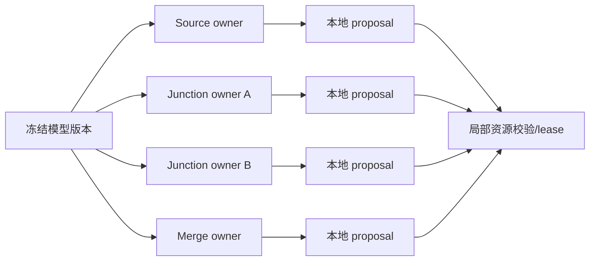

# G4IRSF19 主线方案：流式去中心化学习路由、入口控制与可验证并行执行

> **Repository**：`czr5454112-glitch/jichang_origin`
> **冻结基线**：`codex/g4irsf18-execution@a6124149b30ed580ee2ece79acb16e5b002cfba6`
> **建议新分支**：`codex/g4irsf19-execution`
> **建议 Draft PR 基线**：`codex/g4irsf18-execution`
> **阶段主目标**：让同一套富局部学习策略在多个本地控制点并行工作，使 Source、Route、Merge 三类正常流量决策逐步摆脱 F2；同时查清并突破 4× 的软件执行边界。
> **绝对约束**：不恢复完整 A*、不保存完整未来路线、不扫描全局预约表、不以扩大 event/wall 上限冒充可扩展性。

---

## 0. 执行摘要

G4IRSF18 已经完成了两个关键跃迁：

1. merge 不再在请求到达时提前抢占未来位置，而是在真实服务时刻进行 bounded-pending JIT 仲裁；
2. 学习策略 J7 首次在正常流量 native 闭环中真正拥有并改变动作。

但 G18 还没有完成项目主目标：

- J7 的业务收益近似为零；
- J7 只控制 Merge，Source 和 Route ownership 都是 0；
- 当前模拟器仍是单线程全局事件循环；
- BOLT-P 目前是方法和 M0 测量，不是已实现的多核加速；
- 4× 被 1,200 秒 wall boundary 截断，尚未判断是物理容量、事件循环、队列操作、重试放大还是其他热点。

因此，G19 不能继续把主要预算用在 Merge 上提高名义 ownership，也不能只再做一轮并行潜力 census。G19 必须同步推进两条互相支持的主线：

```text
算法主线：
2× source-wait 拐点
→ Source admission + Route one-hop learning
→ Source/Route 真实动作变化
→ 多头共享策略逐步取代 F2

计算主线：
独立 rollout 并行
→ live frontier 与 CPU 成本测量
→ P=1 snapshot/proposal 等价路径
→ P=2/4/8 纯提案并行
→ 4× 可归因、可续跑、可完成或可证明物理过载
```

最终目标不是“跑了线程”或“训练了模型”，而是同时回答：

1. 学习策略是否真正控制了 Source 和 Route？
2. 同一套策略能否复制到多个本地控制点并发工作？
3. 并行是否带来可测量的 wall-time 收益？
4. 4× 的限制到底来自计算还是固定传送带物理容量？
5. 新框架能否在连续任务流下稳定运行，而不是只能处理一批任务？

---

# 1. G18 的科学结论：好在哪里，差在哪里

## 1.1 明确的好结果

### A. JIT 机制是实质性算法改进

在固定真实地图、2× 完整任务流下：

```text
J0 eager F2：mean TTH = 1394.709 s
J1 JIT FIFO：mean TTH = 959.393 s
J2 JIT fair-aging-deadline：mean TTH = 851.864 s
```

J2 相对 J0 改善约 38.9%，相对 J1 改善约 11.2%。这不是微小工程优化，而是说明“把合流决定推迟到真实服务时刻”本身非常重要。

### B. 学习策略已经不是 shadow

J7 在 43,603 档：

- eligible merge opportunities：3,526；
- applied/owned：3,500；
- feature-distinct mutation：154；
- fallback：26，全部来自 starvation guard；
- hard safety 通过。

这证明模型已经能进入 native 正常流量闭环。

### C. 故障与正常流量机制可以共存

pending-wait 故障门和 exact in-flight lease recovery 都通过，说明 JIT 不必牺牲 G17 已得到的原生故障恢复能力。

### D. GitHub 当前工程状态健康

G18 head 的 Run #61 已完成并通过；PR #3 仍为 open、draft、mergeable，未自动合并。

## 1.2 明确的不足

### A. J7 没有证明业务价值

43,603 档相对 J2：

```text
mean TTH 改善 0.004653 s
p95 / p99 不变
事件 +228
改进袋 207
受损袋 286
```

所以 J7 的意义是“证明学习控制通道真实可用”，不是“学习算法已经赢”。

### B. Merge 的可利用空间可能有限

J7 拥有 3,500 次决定，但只产生 154 次与 J2 不同的动作，动作变化密度约 4.4%。继续均匀提高 Merge ownership，可能只是让模型更频繁地复制 J2。

### C. Source 和 Route 仍由 F2 完全控制

项目要替代完整 A* 路径规划，Route head 必须真正选择下一条边；项目要解决 2× 下占主导的 source wait，Admission head 必须决定何时放行、放谁。只做 Merge 无法完成主线。

### D. 当前没有多核运行证据

BOLT-P M0 只分析了一条 8,192 J7 merge trace。935 个有动作意义的多候选 Merge 机会，其局部评分 pack width 全部为 1。当前 18D affine scorer 又很轻，因此直接给 Merge 加 P=4/8 worker pool 很可能得不偿失。

### E. 4× 仍然不可归因

J0/J1/J2 都在 1,200 秒外部 wall boundary 前没有 native return。现有记录不能说明：

- 完成了多少；
- 当前仿真时钟走到哪里；
- backlog 在增长还是下降；
- event 类型谁占主导；
- CPU 卡在 heap、calendar、queue、retry、trace 还是策略；
- 是否已经达到物理服务能力上限。

---

# 2. “去中心化天然适合并行”——正确，但需要精确定义

## 2.1 用户的直觉基本正确

旧 HCA 路径是：

```text
行李 1 规划完整路线
→ 写入共享预约表
→ 行李 2 看到更新后的预约表再规划
→ 行李 3……
```

它存在长的串行依赖链。

新框架是：

```text
行李到达当前接口
→ 读取该接口附近的局部状态
→ 对合法的一跳动作评分
→ 本地安全仲裁
→ 只提交下一条边或一个短服务时隙
→ 到下一个接口再决定
```

只要两个决定使用不同的本地资源，它们的“看状态和算分”就可以同时进行。

## 2.2 可以有多个计算点，并使用同一套策略

推荐结构不是“一件行李一个永久线程”，而是：

- 每个 Source、Junction、Merge 或小区域有一个本地控制 owner；
- 每个 owner 都加载同一版本的策略参数；
- 行李到达时才触发计算；
- 直线路段没有可选动作时无需调用模型；
- 分流口、入口、合流口才进行决策；
- 模型权重只读，运行时状态归本地 owner 管理。

“同一套策略”更准确地表示：

```text
共享编码器
+ Source head
+ Route head
+ Merge head
```

三类接口共享大部分知识，但动作语义不同，不应强行用一个完全相同的输出头。

## 2.3 并行计算不等于并行提交

两个远离的节点可以同时算。

但两个行李如果都想进入同一条皮带、同一合流口或同一时间槽，就不能同时提交。系统仍需由该资源的 owner 决定谁先走。

因此推荐：

```text
并行：构造特征、模型推理、候选动作准备
串行或局部互斥：资源校验、lease 发放、状态提交
```

这就是 BOLT-P 的 snapshot → parallel proposal → deterministic commit 思路。

## 2.4 必须区分三种并行

### A. 真实机场部署侧并行

不同节点上的控制器本来就可以同时运行。这里最符合“多个计算点、一套策略”的直觉。

### B. 单个模拟器内部并行

当前模拟器仍有一个全局 event heap。要加速它，必须建立可执行 frontier、完整资源读写 footprint 和确定性 commit，不能简单给现有 mutable map 加线程。

### C. 数据生成和训练并行

这是当前最容易获得大收益的部分：

- 不同 workload slice；
- 不同 load；
- 不同 fault case；
- 同一状态的不同反事实动作；
- 不同随机/时间块。

它们可以在独立进程中运行，几乎没有共享状态。G19 应最早实现这一层，而不是等 runtime 多线程完成后才并行生成数据。

## 2.5 并行不能提高皮带的物理吞吐上限

更多 CPU 可以：

- 更快做决定；
- 更快完成仿真；
- 支持更多节点和更多行李的计算；
- 降低规划延迟；
- 加速训练数据生成。

但如果某条皮带每秒最多只能通过固定数量的托盘，CPU 再多也不能让两件行李占用同一个物理位置。过载时正确目标是：

- 计算不崩；
- event 不爆炸；
- backlog 可解释；
- 公平性有保障；
- 实际吞吐稳定在物理上限。

---

# 3. G19 总体方法：BOLT-LC + BOLT-P

G19 建议形成两个相互配合、但结论分别报告的候选。

## 3.1 BOLT-LC：共享权重的流式局部学习控制器

**BOLT-LC** 只作为阶段候选名称，不预先宣称论文贡献。

```text
BOLT-LC
├── Source admission / ordering head
├── Route next-edge / wait head
├── Merge service-order head
└── risk / uncertainty / will-change head
```

每个动作只对当前一步负责。

## 3.2 BOLT-P：确定性并行提案协议

```text
同一 logical frontier
→ 冻结版本化局部快照
→ 声明 bounded read/write keys
→ 构建冲突关系
→ 多 worker 纯计算 proposal
→ 按原始顺序重新校验
→ 原子提交有效 proposal
→ 只重算被前序提交影响的 proposal
```

G19 的论文与工程结论必须把两件事分开：

- BOLT-LC 是否改善业务效果；
- BOLT-P 是否改善计算 wall time。

不能用计算加速掩盖策略无收益，也不能用策略收益冒充并行加速。

---

# 4. 正常流量动作定义

## 4.1 Source head

在一个自然放行机会出现时，从 bounded front 中决定：

```text
ADMIT bag_i
或 HOLD 一次
```

候选只来自同一 Source 的前 K 件可用行李，建议初始 `K ∈ {2,4,8}`，通过实验选取。

允许输入：

- 当前源队列长度、容量、斜率；
- 最近 10/30/60 秒 release 和 admission；
- 每个候选的等待年龄、deadline slack、处理阶段；
- first-edge 可用时间；
- 一跳和二跳下游压力；
- 目标方向上的服务率；
- merge backlog 摘要；
- 故障和 repair generation。

必须有：

- 最大等待年龄强制放行；
- 不允许永久 HOLD；
- 同一 segment 最大 hold 次数；
- 低置信回退 J2/F2。

## 4.2 Route head

只在真正有多个合法下一动作的接口调用：

```text
MOVE(candidate edge 1)
MOVE(candidate edge 2)
...
WAIT once
```

允许输入：

- candidate travel time；
- candidate service time；
- candidate-to-goal 静态剩余时间和跳数；
- second-best gap；
- 当前/候选/一跳/二跳压力；
- scheduled incoming；
- local drain rate；
- recent reverse/visit；
- 当前 segment detour 和 wait 次数；
- fault / lease generation；
- candidate resource footprint。

禁止输入完整未来路线。

静态到目标的距离或启发值可以预计算并作为候选局部特征使用，但模型不得读取“后面具体依次走哪些节点”。

## 4.3 Merge head

保留 G18 的 JIT bounded-pending seam。

G19 不应把主要训练预算继续投入均匀 Merge imitation。Merge 学习只做：

- `will_change_J2_action` 定向覆盖；
- 高不确定性或高潜在收益状态；
- 与 Route/Admission 联合控制后的重新校准。

## 4.4 无决策接口

如果当前节点只有一个安全合法方向：

- 不调用学习策略；
- 直接走唯一动作；
- 只经过 shield 和 resource check。

这能减少无意义推理和 event 数。

---

# 5. 一套策略如何部署到多个计算点

## 5.1 推荐：共享权重、本地副本



模型权重可以由一个离线训练服务产生，但部署时复制到本地 owner。不要让所有实时决策都通过一个远程中央模型服务器，否则中央服务器会重新成为瓶颈和单点故障。

## 5.2 模型版本

每个 proposal 必须携带：

- `policy_epoch`；
- `snapshot_generation`；
- `owner_generation`；
- 相关 corridor/calendar/fault generation。

提交时发现任一版本变化，则 proposal 失效并局部重算。

## 5.3 运行时计数

线程/进程内先维护本地计数，阶段末汇总。不要让每次推理都去争抢一个全局统计锁。

## 5.4 本地状态而非行李永久进程

不建议每件行李都长期占用一个进程。更稳健的是：

```text
本地资源 owner
+ 到达事件
+ 行李短状态
+ 纯策略推理
```

行李离开后不保留昂贵执行实体。

---

# 6. 第一阶段：4× 可归因执行与 live frontier 测量

这一阶段不是“再做检查”，而是为后续算法和并行实现提供必要事实。最多占 G19 总工作量的 15%。

## 6.1 低开销进度快照

长任务每隔固定事件数或固定 wall interval 输出 compact heartbeat：

- simulated time；
- released/completed/failed；
- current backlog；
- source backlog top-N；
- merge pending top-N；
- event total；
- event type histogram；
- event heap size；
- stale/coalesced/retry counts；
- last progress wall time；
- CPU by category；
- RSS。

不得保存全量 candidate trace。

## 6.2 可续跑 worker

把 4× 运行改为可分段：

```text
运行 N events 或 W wall seconds
→ checkpoint
→ 输出进度
→ 从 checkpoint 继续
```

checkpoint 必须保存算法语义状态，而不是只保存报告。

## 6.3 采样式 CPU 分类

建议以固定采样率记录：

- heap pop/push；
- event dispatch；
- source queue；
- route candidate generation；
- merge pending；
- calendar lookup/prepare/commit；
- PIBT；
- feature extraction；
- model inference；
- trace/report；
- checkpoint；
- retry/wakeup；
- fault handling。

采样比例应足够低，不显著改变结果。

## 6.4 live executable frontier

M0 的时间 bucket 不是可执行 frontier。G19 必须在 native runtime 中记录：

- exact event time；
- microphase；
- event seq；
- frontier epoch；
- parent event；
- owner；
- read keys；
- write keys；
- dynamic PIBT footprint；
- proposal compute duration；
- commit duration。

输出：

- frontier width p50/p90/p95/p99/max；
- 最大独立集合的近似宽度；
- Source/Route/Merge 分别的宽度；
- hot owner 占比；
- conflict graph component size；
- 可并行 CPU 份额；
- commit 串行份额；
- 理论最大 speedup 上界。

## 6.5 4× 归因判据

### 更像物理容量饱和

- 关键设备利用率接近 100%；
- offered load 长期超过 service rate；
- backlog slope 为正；
- events/completed bag 有界；
- stale/duplicate/retry 占比低；
- 模拟时间仍稳定前进。

### 更像软件执行瓶颈

- 设备利用率不高但 wall time 极慢；
- event heap 或 queue 操作占主要 CPU；
- stale/retry/wakeup 反复增长；
- 完成数长时间不动；
- 单个 event 成本随规模快速增加；
- trace/report/checkpoint 成本异常。

### 混合情况

分别报告物理下界和软件开销，不强行归为单一原因。

---

# 7. 第二阶段：并行数据生成先行

这是 G19 最早必须落地的真实并行能力。

## 7.1 独立 replica

使用进程隔离的 runtime replica，分配：

- 不同 workload slice；
- 1×/2×/4×；
- 不同时间块；
- 不同 source/route/merge episode；
- 不同故障案例；
- 同一反事实组的不同动作。

## 7.2 配对语义

同一个反事实动作组必须：

- 使用同一初始 checkpoint；
- 使用同一后续 release stream；
- 保持同一 fault schedule；
- 保持 matched pair 在同一 split；
- 不因 worker 完成顺序改变标签。

## 7.3 并行度

至少测试：

```text
P = 1, 2, 4, 8
```

记录：

- groups/hour；
- segments/hour；
- CPU utilization；
- RSS/process；
- I/O；
- checkpoint load cost；
- merge cost；
- speedup；
- efficiency；
- failure/retry；
- 输出确定性。

## 7.4 不把 GPU 当默认答案

当前主要成本可能来自 C++ 仿真而非小模型训练。GPU 可用于模型训练，但 rollout 并行首先使用多进程 CPU replica。必须测量后再决定资源分配。

---

# 8. 第三阶段：Source 与 Route 真实机会和反事实数据

## 8.1 机会 census

在 1× 和 2× 记录：

### Source

- 有多少自然 admission opportunity；
- bounded front 中候选数；
- HOLD 是否真实可选；
- 哪些 source/time/load bucket 有动作差异；
- 当前 F2/J2 的决定；
- 下游压力分布。

### Route

- 有多个合法下一边的 branch 决策数；
- 每个 branch 的候选数；
- F2 action margin；
- candidate resource overlap；
- 近期发生 loop/reverse 的状态；
- 高 source-wait 行李最终经过哪些 branch。

不得把唯一合法动作计为学习 opportunity。

## 8.2 数据规模目标

目标不是盲目堆行数，而是覆盖真实自由度。

建议：

- Source choice groups：至少 5,000；若实际机会更多，分层采样至 20,000；
- Route choice groups：至少 10,000；若实际机会更多，分层采样至 40,000；
- 2× 占训练和验证数据的大部分；
- 至少 1,000 个高价值状态进入较长 horizon；
- 至少 500 个状态进入 full-system externality 配对；
- final audit 独立保留。

若真实机会不足，应扩大合法时间窗口或负载覆盖，不能伪造不存在的候选。

## 8.3 多层反事实 horizon

### H1：短局部

30–120 simulated seconds，用于大规模筛选。

### H2：区域传播

覆盖 2–3 个下游接口或 300–600 simulated seconds。

### H3：系统校准

少量完整后续流，用于判断 H1/H2 是否短视。

## 8.4 标签

相对 J2/F2 安全基线计算净收益：

```text
当前行李 TTH 改善
+ bounded local cohort 总等待改善
+ source backlog 改善
+ downstream queue 改善
- p95/p99 伤害
- deadline 风险
- starvation 风险
- loop/detour 风险
- event 增量
- 计算增量
```

训练输入仍然只含局部运行时信息；完整仿真结果只能作为标签。

---

# 9. 第四阶段：模型家族

## 9.1 强基线

先建立不学习的确定性候选：

- `A0_J2_ADMISSION_OFF`；
- `A1_PRESSURE_GATED_ADMISSION`；
- `R0_F2_ROUTE`；
- `R1_F2_PLUS_LOCAL_PRESSURE_RULE`；
- `RA1_COMBINED_DETERMINISTIC`。

这样可以判断收益来自 action seam 还是学习。

## 9.2 学习候选

至少探索：

### L1：线性 residual

在 F2/J2 分数上预测局部动态修正。

### L2：tiny MLP residual

保留 F2 的基本可达性知识，学习何时偏离。

### L3：standalone candidate scorer

不读取 F2 分数，直接对合法动作评分。它是证明真正替代 F2 的核心候选。

### L4：set-based scorer

对可变数量候选使用小型 DeepSets/attention：

```text
candidate encoder
→ permutation-invariant context
→ per-candidate score
```

### L5：短时间模型

只有 aliasing 证据表明单时刻状态不足时，才加入小 GRU/temporal encoder。

## 9.3 共享策略

优先探索：

```text
共享 candidate/context encoder
+ role indicator
+ Source/Route/Merge action heads
```

同时保留分头模型作消融，判断共享是否导致负迁移。

## 9.4 辅助头

- predicted advantage；
- harm probability；
- OOD/uncertainty；
- `will_change_baseline_action`；
- `will_help_if_changed`。

闭环预算优先给：

```text
会改变基线
且预计有益
且风险低
```

而不是均匀覆盖所有 opportunity。

---

# 10. 第五阶段：research closed-loop ownership

## 10.1 Source ladder

```text
144 / 512 / 2,048 / 8,192 / full
coverage 5% → 10% → 25% → 50% → 80% → 100%
```

报告：

- eligible；
- admit/hold proposals；
- applied；
- distinct mutation；
- starvation fallback；
- source wait；
- backlog；
- downstream effect；
- event delta。

## 10.2 Route ladder

同样运行覆盖率阶梯，报告：

- branch opportunities；
- applied；
- edge mutation；
- WAIT；
- shield reject；
- reverse/loop；
- detour；
- network/source/merge effect。

## 10.3 联合闭环

只有单头分别稳定后再组合：

```text
Source learned + Route F2 + Merge J2
Source J2 + Route learned + Merge J2
Source learned + Route learned + Merge J2
Source learned + Route learned + Merge selective learner
```

避免一开始三个头同时改变导致无法归因。

## 10.4 目标 ownership

### 阶段性成功

- Source 或 Route 至少一个 head 的 eligible ownership ≥20%；
- distinct mutation density ≥5%；
- 2× 有稳定净收益；
- 无尾部和安全退化。

### 强成功

- Source ownership ≥50%；
- Route ownership ≥50%；
- Merge 保持 J2 或选择性 learned；
- 系统整体 F2 fallback 明显下降。

### 替代 F2 声明

- Source、Route 均 ≥70% eligible ownership；
- overall normal-flow F2 fallback ≤30%；
- 1× full 非退化；
- 2× mean 和尾部有可重复收益；
- 4× 计算路径可完成或在物理过载下有界运行；
- faults 全通过。

---

# 11. 第六阶段：BOLT-P 可执行并行路径

## 11.1 P=1 snapshot/proposal seam

先为测得有宽度且计算占比明显的 head 实现：

```text
freeze snapshot
→ pure proposal
→ validate
→ commit
```

P=1 必须与当前串行路径在以下方面一致：

- completion；
- action；
- lease；
- safety；
- terminal state；
- event ordering；
- TTH；
- fault recovery。

性能可以暂时稍差，语义必须先一致。

## 11.2 P=2/4/8 workers

只并行纯计算：

- candidate construction；
- feature extraction；
- model inference；
- local ready-slot calculation；
- proposal serialization。

禁止 worker 直接修改：

- bag；
- queue；
- calendar；
- pending set；
- active grant；
- event heap；
- global counters。

## 11.3 确定性 commit

coordinator 按原始 `(time, microphase, seq)` 验证和提交。

后序 proposal 若因前序提交失效：

- 只重算受影响 proposal；
- 不让线程完成先后决定赢家；
- 记录 validation abort 和 recompute。

## 11.4 进阶：分区 commit

只有在 P=2/4/8 证明 commit lane 成为主要串行瓶颈，并且资源组件长期互不相交时，才探索：

- 多个 disjoint component commit lane；
- zone ownership；
- 跨 zone corridor lease；
- 保守 lookahead。

不得在没有证据时直接重写整个 event runtime。

## 11.5 Python GIL

若从 Python 调用长时间 native runtime：

- 测试是否可安全释放 GIL；
- worker pool 优先放在 C++ 或进程隔离；
- 不要用 Python thread 假装获得 CPU 并行。

---

# 12. 并行评价指标

必须同时报告：

## 12.1 宽度

- live frontier width；
- independent width；
- batch occupancy；
- hot-owner skew；
- conflict component sizes。

## 12.2 成本

- snapshot time；
- proposal compute；
- feature time；
- inference time；
- commit time；
- validation time；
- recompute time；
- event heap time；
- queue/calendar time。

## 12.3 收益

- wall speedup；
- CPU work；
- efficiency；
- worker utilization；
- throughput；
- latency；
- RSS；
- I/O。

## 12.4 代价

- stale proposals；
- validation abort；
- serial recompute；
- extra events；
- extra memory；
- scheduling overhead。

## 12.5 正确性

- exact parity；
- hard safety；
- deterministic repeat；
- fault parity；
- checkpoint parity。

并行成功不要求线性加速，但必须有可重复 wall-time 降低，且收益大于调度开销。

---

# 13. 4× 后续实验矩阵

## 13.1 先做 bounded slices

对 J0/J1/J2 和最有希望的 learned candidate：

```text
5 min wall
15 min wall
30 min wall
checkpoint resume
```

比较每个时间段：

- simulated-time progress；
- completions；
- events；
- backlog；
- CPU categories；
- RSS；
- queue/heap growth。

## 13.2 再做完整 4×

只有当：

- checkpoint/resume 已验证；
- heartbeat 有 native 信息；
- observer overhead 已量化；
- event 类型和热点可解释；

才重跑完整 4×。

## 13.3 8×/16×/32×

开启条件：

- 4× 完成；或
- 明确证明物理过载，但模拟器运行成本、event/bag 和内存仍有界。

若 4× 仍是软件瓶颈，不得跳过它直接跑 8×。

---

# 14. 故障与分布式执行

G19 保留 G17/G18 两类故障门，并增加并行特有案例：

- snapshot 后、proposal 前 fault；
- proposal 后、commit 前 fault；
- policy epoch 更新；
- worker 超时；
- worker 重复返回；
- worker 返回乱序；
- stale generation；
- owner 重启；
- 跨 zone 消息延迟；
- pending 请求在 owner failover 后恢复；
- exact in-flight lease 不得重复消费。

真实部署式多控制点不能依赖“所有控制点永远同时看到故障”。generation 和 lease 必须让迟到消息自动失效。

---

# 15. 失败后的实质 pivot

## A. Source/Route 真实机会很少

- 检查 action seam 是否过早唯一化；
- 区分唯一合法动作和被 F2 提前锁死；
- 将决定点移动到自然 service/admission boundary；
- 不继续训练无自由度的模型。

## B. Route 规则有效、学习无效

- 使用规则/F2 teacher warm start；
- 改用 residual；
- 增加 high-action-gap 和 harmful 状态；
- 检查 feature aliasing；
- 校准 short horizon 与 full effect。

## C. 离线有效、闭环无效

- 检查多次 override 反馈；
- 增加 on-policy counterfactual；
- 限制每 segment override；
- 将 event 和 externality 纳入标签；
- 检查 native/offline feature parity。

## D. P=2/4/8 不加速

先判断原因：

- live width 小；
- scorer 太轻；
- commit 占比高；
- snapshot/serialization 太贵；
- hot owner 过于集中；
- GIL；
- cache/NUMA；
- worker 调度开销。

对应 pivot：

- process-isolated rollout；
- action-first microbatch；
- hot-owner affinity；
- event heap/queue 优化；
- zone partition；
- 更大真实地图/更多独立接口；
- 不继续盲目增加线程。

## E. 4× 是物理过载

目标转为：

- bounded backlog；
- 稳态吞吐；
- 公平；
- deadline-aware admission；
- 有界 event/memory；
- overload recovery。

不要把“不可能完成无限输入”误判为算法失败。

## F. 4× 是软件瓶颈

优先修 CPU 占比最大的类别，不预设一定是策略或 event heap。

---

# 16. 反“忙而无功”约束

以下事项不得成为 G19 主要成果：

- 新增大批 hash/manifest；
- 重新封存旧阶段；
- 只修 CI；
- 只做 census；
- 只写并行设计文档；
- 只实现 P=1 而不测 P>1；
- 只训练不闭环；
- 只提高 ownership 不改变动作；
- 只增加线程不测 speedup；
- 只提高 wall/event cap；
- 只报告零冲突；
- 只做 Merge；
- 只跑 144/512 小案例；
- 用 synthetic opportunity 替代真实 native opportunity。

证据与历史兼容维护总投入原则上不超过 G19 的 10%–15%。

每个主要提交至少产生以下之一：

1. Source/Route 真实决策机会；
2. Source/Route 正常流量 action mutation；
3. 业务效果变化；
4. 可测量并行 speedup；
5. 4× 明确容量归因；
6. 一个被证伪后完成的实质性 pivot。

---

# 17. 建议提交序列

```text
G19-A  live frontier + low-overhead 4x progress/checkpoint profiling
G19-B  process-isolated counterfactual rollout farm P=1/2/4/8
G19-C  native Source admission action seam and opportunity census
G19-D  native Route one-hop action seam and opportunity census
G19-E  Source/Route counterfactual datasets + full-system calibration
G19-F  deterministic, residual, standalone and set-model ablations
G19-G  Source research closed-loop ladder
G19-H  Route research closed-loop ladder
G19-I  joint Source+Route closed loop with Merge J2
G19-J  BOLT-P P=1 parity and P=2/4/8 proposal executor
G19-K  resumed 4x attribution/full campaign and overload analysis
G19-L  parallel/fault campaign and final joint decision
```

允许根据证据调整顺序，但禁止在 G19-A、G19-B、G19-C 或一份并行报告后提前结束整个阶段。

---

# 18. 主要交付物

```text
docs/G4IRSF19_streaming_learned_parallel_mainline.md

outputs/reports/g4irsf19_current_state.md
outputs/reports/g4irsf19_live_frontier_and_cost.md
outputs/reports/g4irsf19_rollout_parallelism.md
outputs/reports/g4irsf19_source_admission.md
outputs/reports/g4irsf19_route_control.md
outputs/reports/g4irsf19_feature_aliasing.md
outputs/reports/g4irsf19_model_ablation.md
outputs/reports/g4irsf19_source_closed_loop.md
outputs/reports/g4irsf19_route_closed_loop.md
outputs/reports/g4irsf19_joint_closed_loop.md
outputs/reports/g4irsf19_bolt_p_executor.md
outputs/reports/g4irsf19_scale_capacity.md
outputs/reports/g4irsf19_fault_parallel_campaign.md
outputs/reports/g4irsf19_final_joint_decision.md

outputs/tables/g4irsf19_*.csv/json
artifacts/models/g4irsf19_*.json
artifacts/policies/g4irsf19_*.json
artifacts/datasets/g4irsf19_* 或可重建 manifest
```

原始超大 trace 可以保留为本地可再生输出；必须提交 compact、可验证、足以复现结论的中间结果。

---

# 19. 最终必须直接回答的问题

1. G18 head 和 G19 head 的 CI 是否全绿？
2. Source 有多少真实选择机会？
3. Route 有多少真实多动作机会？
4. 学习策略在 Source 改变了多少动作？
5. 学习策略在 Route 改变了多少动作？
6. Source/Route/Merge ownership 分别是多少？
7. overall F2 fallback 是多少，原因是什么？
8. 哪个特征组真正有效？
9. residual、standalone、set scorer 谁最好？
10. 2× source wait 是否进一步下降？
11. mean/p95/p99 是否同时不退化？
12. 并行 rollout 的 P=2/4/8 speedup 是多少？
13. live executable frontier 的宽度是多少？
14. BOLT-P P=1 是否与串行严格等价？
15. BOLT-P P=2/4/8 是否有可重复 wall-time 收益？
16. 并行瓶颈是 compute、commit、conflict、heap 还是 hot owner？
17. 4× 的边界是物理容量、软件执行还是混合？
18. 4× 是否完成；若无法完成，运行是否仍有界？
19. 多控制点下故障、迟到消息和 worker failover 是否安全？
20. 是否已经可以诚实地说：学习策略成为正常流量主控制器？
21. 是否已经可以诚实地说：去中心化框架获得了可测量的并行计算优势？
22. 若仍不能，下一条最窄、最有价值的 pivot 是什么？

---

# 20. 最终方向

用户关于并行的核心理解是正确的：

```text
行李持续进入
→ 在系统中并发移动
→ 到有选择的接口时才调用同一套局部策略
→ 不同接口可以同时算
→ 同一资源仍由本地 owner 仲裁
→ 下一接口再次决策
```

项目下一阶段不应把去中心化仅当作“不要 A*”的约束。它还应成为一种计算结构：

- 决策小；
- 状态局部；
- 权重共享；
- owner 分散；
- 推理可并行；
- 提交有界；
- 故障局部化；
- 数据生成可扩展。

G19 的真正成功是：

> **学习策略开始控制 Source 和 Route，多个本地计算点使用同一套策略并发做纯计算，4× 的执行边界被查清并实质改善，同时保留零完整 A*、零全局预约扫描和严格安全。**
