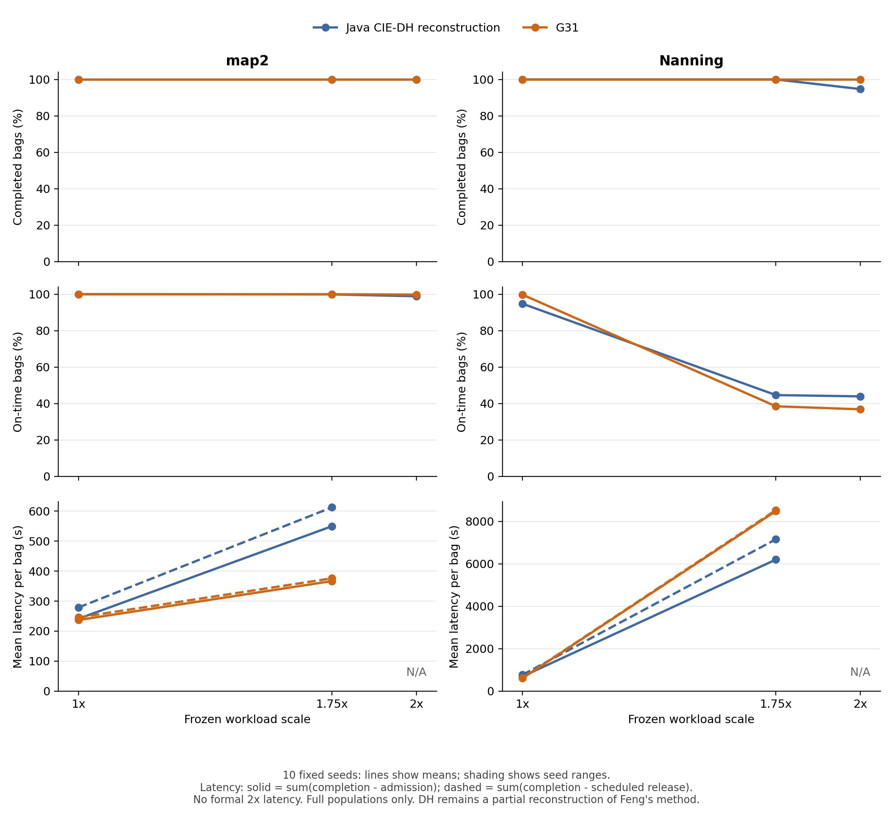

# Feng CIE-DH 修复、实验与 G31 比较（2026-09-05）

**矩阵状态：`COMPLETE`；有效执行格 180/180，修复后南宁 DH 30/30。** 预设两地图、三负载、十种子、三方法矩阵已经齐全。

本报告由 `scripts/eval/write_feng_repaired_report.py` 从[逐格 CSV](../tables/feng_cie_dh_repaired_cells_20260905.csv)、[配对 JSON](../tables/feng_cie_dh_repaired_paired_20260905.json)与[配对 CSV](../tables/feng_cie_dh_repaired_paired_20260905.csv)生成，配对 bootstrap 区间和全部指标保留在这些机器可读表中。

## 四项独立结论

| 检验轴 | 结论 |
|---|---|
| 程序正确性 | PASS（所列回归范围）；零服务有限完成、同步竞争/跟驰/阻塞释放、真实业务 OD、全人口回归通过后才接受新结果。 |
| 论文语义恢复 | `SEMANTICALLY_PARTIAL_RECONSTRUCTION`；through/transfer 合同与 0.4/0.8 s 系数仍是披露的重构假设。 |
| 历史数值匹配 | shared-D mean：238.7023 vs 265.5921 s；max：326.0 vs 517.2 s。原重构偏乐观的差距保留，未通过人为等待或调参抹平。 |
| G31 性能 | 按同输入、同种子、同指标给出有条件的优势和代价；map2 1× 的尾部反例与独立 same_hca 2× 反例保留。 |

正确性提交 `8da1844` 与等价优化提交 `0ca1f45` 分离；新南宁源 SHA-256 `809d069832da3fec5a2aa6302a99a9ede24fcd5a1fb28c4a53c3cc3c139ff86f`，类 SHA-256 `ad828f533bc34abb3527d92f0f476e69412fc14c0024cbf2694bf0f82b382fd0`。

## 正确性、复用与原始证据

[regression_final](../runtime/feng_cie_dh_zero_through_repair_20260905/regression_final/map2_full_population_regression.json)与[regression_optimized](../runtime/feng_cie_dh_zero_through_repair_20260905/regression_optimized/correctness_to_optimized_equivalence.json)记录原 map2 28,506 袋、43,603 段在旧版、正确性版、优化版间逐袋/逐段字节一致，统计只允许墙钟不同；因此复用 map2 90 格和不受独立 Java bug 影响的南宁 HCA/G31 60 格。外部随机实验段数从各格 identity 读取，不把原始 map2 的 43,603 段强行套到投影输入。[发表追溯说明](../runtime/feng_cie_dh_zero_through_repair_20260905/publication_traceability/README.md)提供可下载的 map2 共享全人口归档、60 格输入 identity，以及源码/输入换行转换和原始字节 SHA 的独立复核。

[无拥堵 OD 回归](../runtime/feng_cie_dh_zero_through_repair_20260905/regression_optimized/single_bag_equivalence_and_archives.json)通过 522 个案例（25 个 map2、496 个南宁正式 OD，加 130→57→58 拓扑见证）。[实际业务见证](../runtime/feng_cie_dh_zero_through_repair_20260905/regression_final/repaired_formal_business_witness.json)保留 raw bag 7007、segment 0、0→20 经零时间中间节点 56 的旧错误与新完成状态。原 T1–T10、新 Z1–Z12、跨 snapshot 缓存失效均有独立断言。

[trace=1 拥堵对照](../runtime/feng_cie_dh_zero_through_repair_20260905/optimization_equivalence_v1/verification.json)的 128 袋/256 段输出逐字节一致；样本包含 42,326 次 HOLD、40,210 个 stopped ticks 和 1,390 次同 snapshot/node/goal 重复请求。[全人口优化对照](../runtime/feng_cie_dh_zero_through_repair_20260905/optimization_full_population_1x.json)：南宁 1×、seed 104729 的正确性修复版与优化版均完成 28,506 袋、43,602 段，逐袋/逐段/事件输出一致，逻辑决策 53,015,149 次不变。记录模拟墙钟 251.681→85.909 s（2.93×）；这是保持行为不变的实现优化对照，不是 G31 加速比。

[可移植归档](../evidence/feng_cie_dh_repair_20260905/archive_manifest.json)当前含 30/30 个新南宁 DH 格，保留完整 bags/segments 的无损 gzip、summary、事件计数、runner 身份与压缩前后 SHA；归档已覆盖本次全部新南宁格。

[全人口独立审计](../evidence/feng_cie_dh_repair_20260905/population_audit.json)逐格核对正式 OD、释放时刻、行李/运输段身份、完成状态和事件计数。正式 trace=0 终态文件没有逐 tick 位置或服务启动次数，不能单靠该审计证明逐 tick 无碰撞或零服务从不重启；这些性质的证据来自前述微测、拥堵轨迹对照与运行时断言。

旧南宁 16 个终止文件和 14 个中断格均原样保留，另加[科学有效性旁车](../runtime/cie_external_baseline_robustness/scientific_validity_20260905.json) `INVALIDATED_ZERO_THROUGH_STATE_MACHINE_BUG`。旧约 44% 完成率不能表示有效 DH 性能；834.18× 是旧程序南宁/map2 决策数比，582.73× 是墙钟比，均不是 G31 加速比。它们作为正常拥堵扩展性证据的解释已经撤回。

## 固定十种子矩阵与同口径结果

| 地图/负载 | DH | G31 | HCA |
|---|---|---|---|
| map2 1× | 10/10 | 10/10 | 10/10 |
| map2 1.75× | 10/10 | 10/10 | 10/10 |
| map2 2× | 10/10 | 10/10 | 10/10 |
| 南宁 1× | 10/10 | 10/10 | 10/10 |
| 南宁 1.75× | 10/10 | 10/10 | 10/10 |
| 南宁 2× | 10/10 | 10/10 | 10/10 |

以下每个“DH / G31”单元只用同一批已观测配对种子；数值为种子统计量的算术平均，不是把所有袋合并后重新算分位数。未齐十种子不作最终稳定性结论。所有格固定 horizon 为 98,259 s。

| 地图/负载 | 配对 | 平均完成袋数 DH / G31 | 准时率 % DH / G31 | DH 源/网/总积压（百万 bag-s） | G31 源/网/总积压（百万 bag-s） |
|---|---|---|---|---|---|
| map2 1× | 10/10 | 28,506.0 / 28,506.0（分母 28,506） | 100.00 / 100.00 | 64.95 / 5.85 / 70.80 | 64.16 / 5.98 / 70.14 |
| map2 1.75× | 10/10 | 49,765.0 / 49,765.0（分母 49,765） | 99.89 / 100.00 | 114.72 / 15.56 / 130.28 | 112.11 / 12.36 / 124.47 |
| map2 2× | 10/10 | 57,012.0 / 57,012.0（分母 57,012） | 98.88 / 99.79 | 132.45 / 23.89 / 156.34 | 128.40 / 16.12 / 144.52 |
| 南宁 1× | 10/10 | 28,506.0 / 28,506.0（分母 28,506） | 94.75 / 99.72 | 65.61 / 16.89 / 82.50 | 64.21 / 14.32 / 78.53 |
| 南宁 1.75× | 10/10 | 49,765.0 / 49,765.0（分母 49,765） | 44.61 / 38.46 | 151.59 / 286.82 / 438.40 | 113.36 / 323.48 / 436.84 |
| 南宁 2× | 10/10 | 53,998.6 / 57,012.0（分母 57,012） | 43.91 / 36.81 | 200.49 / 467.45 / 667.94 | 131.84 / 647.84 / 779.68 |

入网后时延为 `Σsegments(completion - admission)`：DH `diagnostic_first_admission_to_completion` 与 G31 `processed_attempt` 使用同一逐段求和口径，均不含源端等待。正式 2× 一律 N/A；低负载任何配对格未完成全人口时，整组时延显示 N/A，不挑完成种子或幸存袋。

| 地图/负载 | 计时资格/配对 | mean s DH / G31 | P95 s DH / G31 | P99 s DH / G31 | max s DH / G31 |
|---|---|---|---|---|---|
| map2 1× | 10/10 | 241.47 / 237.15 | 293.74 / 338.73 | 320.46 / 401.16 | 370.32 / 526.10 |
| map2 1.75× | 10/10 | 549.60 / 366.74 | 2,452.60 / 1,199.36 | 2,994.13 / 2,844.51 | 3,259.28 / 3,238.98 |
| map2 2× | 2×协议 N/A | N/A | N/A | N/A | N/A |
| 南宁 1× | 10/10 | 695.85 / 611.35 | 2,780.55 / 2,343.50 | 3,603.66 / 2,717.01 | 3,893.94 / 4,554.07 |
| 南宁 1.75× | 10/10 | 6,202.95 / 8,492.88 | 15,619.98 / 26,550.36 | 16,304.24 / 31,015.98 | 17,047.82 / 32,663.63 |
| 南宁 2× | 2×协议 N/A | N/A | N/A | N/A | N/A |

补充统一 scheduled-release 分栏为 `Σsegments(completion - scheduled release)`，包括该释放之后的源端等待。它从现有全人口输出重聚合，不是历史 shared-D，也没有为改列名重新模拟。资格限制与上表一致。

| 地图/负载 | 计时资格/配对 | mean s DH / G31 | P95 s DH / G31 | P99 s DH / G31 | max s DH / G31 |
|---|---|---|---|---|---|
| map2 1× | 10/10 | 278.99 / 245.77 | 430.04 / 374.15 | 528.06 / 452.73 | 734.10 / 602.23 |
| map2 1.75× | 10/10 | 612.46 / 376.05 | 2,590.45 / 1,224.33 | 3,501.84 / 2,878.88 | 3,823.30 / 3,300.73 |
| map2 2× | 2×协议 N/A | N/A | N/A | N/A | N/A |
| 南宁 1× | 10/10 | 773.14 / 623.01 | 3,121.31 / 2,368.33 | 3,714.39 / 2,739.69 | 6,513.41 / 4,725.65 |
| 南宁 1.75× | 10/10 | 7,160.03 / 8,535.56 | 16,143.03 / 26,561.36 | 26,579.51 / 31,028.05 | 32,087.23 / 32,663.80 |
| 南宁 2× | 2×协议 N/A | N/A | N/A | N/A | N/A |

图中阴影为固定十种子的范围；实线/虚线分别对应入网后/计划释放后计时。

## 有数据支持的优势与代价

- **map2 1×（十种子）**：G31 平均完成量持平（G31 − DH：+0.0 袋）；G31 入网后 mean 低 1.79%；P95/P99/max 分别高 15.32%、高 25.19%、高 42.07%；统一 scheduled-release mean 低 11.91%；准时率持平；总积压面积低 0.93%。完成量逐种子胜/平/负为 0/10/0；准时率为 0/10/0；入网后 max 为 0/0/10。
- **map2 1.75×（十种子）**：G31 平均完成量持平（G31 − DH：+0.0 袋）；G31 入网后 mean 低 33.27%；P95/P99/max 分别低 51.10%、低 5.00%、低 0.62%；统一 scheduled-release mean 低 38.60%；准时率高 0.11 个百分点；总积压面积低 4.46%。完成量逐种子胜/平/负为 0/10/0；准时率为 10/0/0；入网后 max 为 6/0/4。
- **map2 2×（十种子）**：G31 平均完成量持平（G31 − DH：+0.0 袋）；准时率高 0.90 个百分点；总积压面积低 7.56%。完成量逐种子胜/平/负为 0/10/0；准时率为 10/0/0。
- **南宁 1×（十种子）**：G31 平均完成量持平（G31 − DH：+0.0 袋）；G31 入网后 mean 低 12.14%；P95/P99/max 分别低 15.72%、低 24.60%、高 16.95%；统一 scheduled-release mean 低 19.42%；准时率高 4.97 个百分点；总积压面积低 4.81%。完成量逐种子胜/平/负为 0/10/0；准时率为 10/0/0；入网后 max 为 0/0/10。
- **南宁 1.75×（十种子）**：G31 平均完成量持平（G31 − DH：+0.0 袋）；G31 入网后 mean 高 36.92%；P95/P99/max 分别高 69.98%、高 90.23%、高 91.60%；统一 scheduled-release mean 高 19.21%；准时率低 6.16 个百分点；总积压面积低 0.36%。完成量逐种子胜/平/负为 0/10/0；准时率为 0/0/10；入网后 max 为 0/0/10。
- **南宁 2×（十种子）**：G31 平均完成量高 5.58%（G31 − DH：+3,013.4 袋）；准时率低 7.10 个百分点；总积压面积高 16.73%。完成量逐种子胜/平/负为 10/0/0；准时率为 0/0/10。

独立无抖动、相同 HCA release 的 [same_hca 临界负载 2×](cie_critical_load_curve_v2.md)反例仍为：DH 准时率 98.89%（56,379/57,012），G31 53.03%（30,231/57,012）；总积压面积分别约 1.563e8 与 2.935e8 bag-s。该释放协议不能与上面的随机外部实验拼接。正式 2× 时延继续为 N/A。

[原生 HCA/G31 正式比较](cie_baseline_comparison.md)仍保留：在相同 HCA release 的 1× 完整人口上，G31 相对 HCA 的 mean 在 map2/南宁分别低 11.532%/24.365%，其尾部与容量证据来自原独立科目。同一报告中的公共 C++ 执行器 CIE-DH adapted 仅用于 P1 路由机制隔离；[析因](cie_random_factorial_full.md)和[消融](cie_targeted_ablation_report.md)也保持各自执行器及协议。

## 实际计算成本与测量限制

| 地图/负载 | 配对 | wall s DH / G31 | CPU s DH / G31 | 决策请求 DH / G31 | 记录来源 DH / G31 |
|---|---|---|---|---|---|
| map2 1× | 10/10 | 51.82 / 32.15 | N/A / 30.42 | 5,841,093 / 336,516 | 历史复用 / 历史记录 |
| map2 1.75× | 10/10 | 371.01 / 79.46 | N/A / 66.66 | 91,981,332 / 586,238 | 历史复用 / 历史记录 |
| map2 2× | 10/10 | 728.89 / 84.12 | N/A / 80.69 | 220,824,591 / 672,251 | 历史复用 / 历史记录 |
| 南宁 1× | 10/10 | 79.25 / 66.83 | N/A / 64.03 | 52,997,630 / 588,845 | 本次修复优化 / 历史记录 |
| 南宁 1.75× | 10/10 | 615.72 / 561.24 | N/A / 534.33 | 1,661,731,634 / 1,034,012 | 本次修复优化 / 历史记录 |
| 南宁 2× | 10/10 | 1,085.29 / 1,336.57 | N/A / 1,289.78 | 2,807,182,196 / 1,184,919 | 本次修复优化 / 历史记录 |

DH wall 是 native simulator 计时，G31 wall/CPU 是原生 runtime 记录；HCA、Java、C++ 的计时边界并非完全同一进程包络。表中 map2 DH/G31 和南宁 G31 为历史有效记录，南宁 DH 为本次修复优化记录；不同采集时刻、JVM 预热和并发资源竞争影响墙钟，不能把这些数值当作受控单核速度排名。缺失 CPU 保持 N/A；决策请求定义按各方法原生日志，不据其数量直接推导算法时间复杂度。

## 可重复生成

`python scripts/eval/export_feng_repaired_evidence.py --archive` 依赖本机完整原生运行目录，用于更新逐格表和归档。使用已提交的逐格 CSV、配对 JSON/CSV 与回归证据，可直接运行 `python scripts/eval/write_feng_repaired_report.py` 重生成报告；完整矩阵还可运行 `python scripts/eval/plot_feng_repaired_comparison.py` 重生成图。报告和绘图步骤不启动模拟。报告生成器对旧南宁源码、重复坐标、跨方法输入身份不一致、JSON/CSV 不同步及不合格正式时延直接报错。

本次输入 SHA-256：

- `feng_cie_dh_repaired_cells_20260905.csv`：`7c33aae4d27e3dc98b4ec883b15dbdb179f7331a68b0058b98501c1a58be3a56`。
- `feng_cie_dh_repaired_paired_20260905.json`：`69de956ed5d61c78f06b78da1aed1d781de77cc1355c4e41cc57114cf56cb808`。
- `feng_cie_dh_repaired_paired_20260905.csv`：`04a644b49e12eadb5ba5016f5d2153b1e249ba6a02f9b0255831b97c9f09c2e3`。
