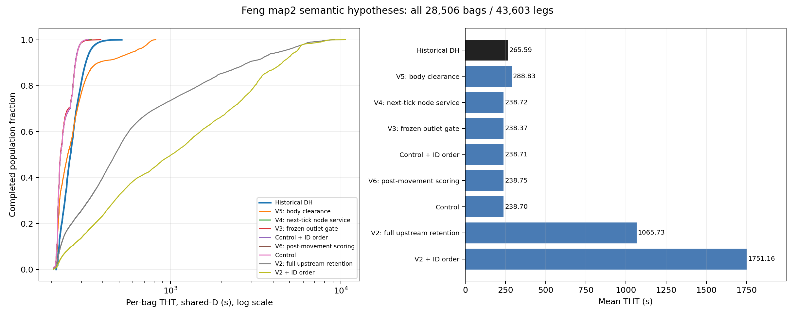

# Feng DH：一手资料复查与 map2 执行语义实验

本轮目标是辨认现重构偏强的来源，并得到性能接近或适度劣于 Feng CIE 数据、且实现可辩护的 DH。九次 map2 复核完成后，用户已在知悉 V5 均值约 +8.75%、最大值 819 秒及尾部限制的情况下选择采用 V5。**当前采用 V5 作为披露假设的 DH 重构基线，继续 map2 与南宁的正式扩展比较。** 该决定是结果已知后的用户选择，见[采用记录与新实验合同](../../docs/baselines/feng_dh_v5_acceptance_and_campaign_protocol_20260905.md)；原先 5%/10% 阈值仍只作诊断。

**九次完整 map2 对照与此前不建议晋升 V5 的独立判断均保留。** V5 均值更接近，重尾仍与未经恢复的保守几何近似有关；用户接受其作为实用重构基线，不等于将其标成原作者源码或完整论文复现。原控制程序、先前完成的实验和所有候选分别保留，失败或偏离的结果也完整归档。下文保留语义辨识证据与局限，G31 的实际优势须在采用 V5 后的共同实验合同下测量。

## 1. 实际读到的材料与修正后的来源结论

本轮重新阅读 Feng 学位论文、CIE 一审修订查验稿、审稿回复、原 Java/HCA 工程，并按确切参考文献读取 Tarău、De Schutter、Hellendoorn 的 **Route Choice Control of Automated Baggage Handling Systems**，Transportation Research Record 2106:76–82，2009，DOI [10.3141/2106-09](https://doi.org/10.3141/2106-09)。[作者公开技术报告](https://www.dcsc.tudelft.nl/~bdeschutter/pub/rep/09_011.pdf)提供全文；另一篇同年的集中/分散控制文章和同题会前稿不能替代这条引文。

本地 CIE 文件是 37 页一审修订查验稿，并未确认它等于出版社最终排版版本。对应 DH 步骤及 Table 4 在 PDF 25–26 页；学位论文的 DH 步骤及表 5.3 在 PDF 43 页、印刷页 29。原件身份、页码和逐条证据见[一手审计](../../docs/baselines/feng_dh_primary_semantics_reaudit_20260905.md)。

这些材料支持以下边界：

- Feng 明确另行从头编写 DH 仿真器；共享地图、速度和需求，不等于 DH 直接使用了 HCA 的预约执行器。当前独立 Java DH 没有调用 G31 的 C++ 执行器，也没有 HCA 的未来全路径预约。
- **沿完整候选最短路径统计 moving/stopped 拥堵有 Feng 原文依据。** 不能把它改成只看下一条边，再把较弱的结果称为纠正了额外能力。
- 当前程序确实在 through 后释放上游占位，并允许行李在边外等待出口任意久；这批等待不占边容量，也不进入边上 moving/stopped 罚项。它是未识别的空间/可见性假设，可能使重构过于理想化。
- 固定 2 秒交接、具体移动/停止罚项数值、精确迭代顺序和节点缓冲容量仍未从 Feng DH 源码中恢复。Tarău 的开关记忆、最小开关间隔及权重也不能直接当成 Feng 简化器参数。

先前只搜索外部 `.java` 或模型 `Source` 会漏掉代码。本轮进一步解包 70.96 MB Demo3D XML、73 个脚本容器中的 NativeSource/C# 工程及可视化 AST，核对 3,267 个实际脚本绑定。**找到了设备控制和外部目标表接口，仍未找回独立 DH 路由器。** 47 个“2 秒”属于 lift 子部件属性；77 个路口控制器配置为 0.6 秒，且保存的 linear-physics 设置会禁用可读控制器。可视化脚本中的 0.2 秒属于主调用链未启动的硬编码目标映射 helper，不能当作 DH tick 源码。紧凑证据与提取器见[模型证据索引](../runtime/feng_dh_semantics_reaudit_20260905/primary_model_evidence/README.md)，不提交整份厂商库、DLL 或通信配置。

## 2. 相同输入、人口与正式时间口径

每个全图候选固定原始 map2、同一需求及历史 shared-D，速度 2.5 m/s、tick 0.2 秒、moving/stopped 罚项 0.4/0.8，不删任务、不改变 OD、不按结果换种子。每次都运行到 **28,506 件原始行李、43,603 个运输段全部完成**。

本文正式 THT 按每袋各段 `Σ(completion E − shared scheduled release D)` 重算，包含释放后的源端等待，不包含两段之间计划的 EBS 存储间隔。不能把其他实验的入网后 latency、带抖动 scheduled-release 或同 HCA admission 结果拼入本表。P95/P99 仅用于诊断分布；Feng 的直接 DH 对照表报告 THT 最小、平均、最大值。

历史工作簿的 DH 原始 D/E 与袋级缓存已独立核对；不能使用错位的 F 辅助列代替同行 `E-D`。历史精确秒数对应论文四舍五入的 3.56 / 4.43 / 8.62 分钟。

所有候选均在全图运行前记录假设、源码身份和夹具结果。每次归档包含实际命令、五份源码和所有生产 class 的逐文件 SHA、输入及协议 SHA、完整逐袋/逐段 CSV 的确定性 gzip、人口和统计复核。微测试使用的 Java 8 target 与正式 JDK 18 默认编译目录分开，类身份分别记录，不冒称相同二进制。

## 3. 已完成的全人口结果

单位为秒；完整机器表见[汇总 CSV](../tables/feng_dh_semantics_reaudit_20260905.csv)，所有 25 个 OD 的对照见[OD 表](../tables/feng_dh_semantics_reaudit_20260905_by_od.csv)。

| 执行语义 | 最小 | 平均 | P95 | P99 | 最大 |
|---|---:|---:|---:|---:|---:|
| 历史 DH 工作簿 | 213.30 | 265.59 | 336.90 | 384.60 | 517.20 |
| 冻结控制版 | 206.40 | 238.70 | 285.20 | 300.80 | 326.00 |
| V2：整段转运保留上游占位 | 206.40 | 1065.73 | 4497.70 | 6693.98 | 9180.20 |
| 控制版 + 按任务 ID 裁决 | 206.40 | 238.71 | 284.20 | 300.80 | 331.00 |
| V2 + 按任务 ID 裁决 | 206.00 | 1751.16 | 5493.80 | 7588.28 | 10611.60 |
| V3：离开前检查停止的出口首袋 | 206.40 | 238.37 | 284.40 | 303.20 | 389.60 |
| V3：修正为冻结状态检查 | 206.40 | 238.37 | 284.40 | 303.20 | 389.60 |
| V4：下一 tick 才复用节点服务 | 206.40 | 238.72 | 285.20 | 302.40 | 342.20 |
| V5：按身体长度/速度清空边界 | 206.40 | 288.83 | 620.00 | 753.20 | 819.00 |
| V6：更新位置/状态后再评分 | 206.40 | 238.75 | 285.60 | 301.00 | 326.20 |

V3 的原版在零 through 链上存在同 tick 读取可变状态的问题；快照修正版用独立夹具消除了节点 ID 顺序泄漏。map2 没有相应零时间中间节点，两个版本的逐袋、逐段和事件输出逐字节一致，因此不能把它们当成两个独立的数值结论。



## 4. 占位实验真正说明了什么

原控制的平均值比历史快 **10.12%**，最大值快 **36.97%**。单改合流裁决顺序、同 tick 节点复用或提前检查停止出口，不能解释这段差距；这排除了几个简单解释，不证明其他未识别语义正确。

V2 保留原有 1 秒 through 与 2 秒转运，节点独占仍只持续原 through；但上游身体占位一直保留到真实进入下游。它使同入口服务起点间隔从 1.4 秒变为 3.4 秒，产生严重回压。全人口平均 1065.73 秒，明显超出“不要劣化太多”的要求。不能用这组弱化后的数值比较 G31，也不能因其变慢便宣称没有边外缓冲才是错误模型。

V5 是单独的粗几何假设：由 `(行李长 + 安全距) / 入边速度` 得到 map2 的 0.4 秒身体清空期。through 身份按原时刻释放，上游只在这 0.4 秒保留；总转运仍在原来的 2 秒时刻结束。9 个机制夹具验证了单袋时刻不变、同入口起点间隔增加 0.4 秒、不同入口服务间隔不变、零 through 只执行一次、长度变化能推导不同清空期。

它没有新增可调延时，但也不是恢复出的几何引擎：离边后等待仍继承控制版合同；清空阶段被近似为保留 STOPPED 身体，因此同时改变回压和评分可见的 stopped 计数。均值 **288.83 秒，即历史的 +8.75%**，本身可进入用户允许的接近范围；然而最大值高 **58.35%**，P95/P99 高 **84.03%/95.84%**，不能只报均值就宣布完整行为接近。

对 V5 的独立尾部复核进一步发现：中位数 249.4 秒仍低于历史 258.7 秒，2,046 袋（7.18%）超过历史最大值。最慢 5% 的增量主要发生在入网后，EBS 袋主要慢在入库段；早高峰多个 OD 的持续积压抬高了尾部。全体比控制多出的时间有 97.50% 发生在入网后，不能用源端时钟错位或少数异常行解释。详见[尾部审查](feng_dh_boundary_clearance_tail_review_20260905.md)。

控制版本来已有 1 秒 through 加约 0.4 秒后随移动的同入口间隔。V5 再将完整身体原地 STOP 保留 0.4 秒，清空后仍有原来的后随移动过程，得到 1.8 秒间隔；这可能将连续几何中可同步的清空与跟随串行化。它对应约 2,000 袋/小时的理想容量，低于早高峰共同通道相关 OD 的 2,338 段/小时释放代理量。这个对照解释了候选自身为何积压，却不能证明作者也采用同样容量；代理量不是未记录的实际边流量。

V6 单独检验了更直接的文字依据：Feng 的步骤 (a) 更新状态，然后 (b) 评分。实现只把评分改为计划移动后的独立冻结视图，保持原物理入口检查和仲裁；生产断言持续确认评分不反馈改变本 tick 的腾空集合或移动计划。19 个父/候选夹具全部通过，5 个场景产生预期的首次出口差异，零/正 through 单袋仍在 tick 28/33 完成。全人口 mean 仅比控制增加 **0.04703 秒**，最大值为 326.2 秒。它证明评分观察时刻会改变具体决策，但在当前空间合同下，不是历史均值和尾部差距的主要解释。协议及逐事件证据见[V6 预注册](../../docs/baselines/feng_dh_post_movement_scoring_preregistration_20260905.md)与[夹具身份](../runtime/feng_dh_semantics_reaudit_20260905/post_movement_scoring_fixtures/derivation_and_fixtures.json)。

## 5. 历史数据对下一步的约束

[历史时间签名审计](feng_dh_historical_timing_signatures_20260905.md)独立匹配了全部段，并发现 25 个 OD 的历史最短样本仅比当前孤立距离最短路线慢 0.3–1.4 秒。按任务组成折算约 1.083 秒/袋，只解释当前 26.890 秒平均差额的 4.03%；其余是最短样本以上的时间及路径差额，不能直接等同于纯拥堵。

因此没有证据支持给所有行李固定补十几秒。历史全部完成时刻落在 0.1 秒网格，也不证明内部步长就是 0.1 秒；其中约一半不能落在同一个全局 0.2 秒相位。“每节点 3.1 秒”能近似部分最短样本，但另有低于该模型全图物理最优值的反例，不能据此强行校准。

部分当前动态路线比其孤立的距离最短路线更快，是因为较长的路线可以经过更少的有服务时间节点；这不是超越物理下界。该效应仅解释约 1.07% 的均值差额。改变路径集、给每节点增加路线罚项或锁定下一跳，都需要独立证据，不能为了 G31 胜率把候选改弱。

## 6. 可复现入口与当前边界

运行一个隔离的 map2 候选：

```powershell
python scripts/eval/run_feng_dh_semantics_reaudit.py --name boundary_clearance_v5_new_run --source-dir benchmarks/java/feng_cie_dh_boundary_clearance_v5/App --protocol docs/baselines/feng_dh_boundary_clearance_preregistration_20260905.md
python scripts/eval/report_feng_dh_semantics_reaudit.py
python scripts/eval/audit_feng_dh_reaudit_bundle.py
```

上述 map2 诊断 runner 拒绝覆盖既有实验，其本身不会自动发起南宁或扩展矩阵。当前已授权的 V5 扩展使用[独立新合同](../../docs/baselines/feng_dh_v5_acceptance_and_campaign_protocol_20260905.md)和独立结果目录；不改写此 runner 的历史 `extension_authorized=false` 输出。压缩全人口档案可在没有本机 build 目录的克隆中复核：逐段 shared-D、ID/OD/重数、完成状态、原始 CSV SHA 及逐袋 THT 均重新检查。原材料提取需要用户持有的原件；已提交的紧凑摘要和全部数值证据可直接阅读。

截至本轮记录，冻结控制源码五文件身份仍为 `809d069832da3fec5a2aa6302a99a9ede24fcd5a1fb28c4a53c3cc3c139ff86f`。新版本是有机制依据、可以检验的独立重构候选，均不能标为 `FENG_SOURCE_EXACT_CIE_DH`。完整数值及身份校验结果见[可移植验证记录](../runtime/feng_dh_semantics_reaudit_20260905/portable_verification.json)。

此前不建议晋升 V5 的原因是新增容量瓶颈的几何依据不足、且同批早高峰任务产生了历史没有的重尾，不是它超过了已经放宽的旧百分比门槛。这仍是有效的局限说明，但已不是当前用户采用 V5 后的运行阻断条件。冻结采用版本后，不继续按历史均值调整清空时间、罚项或任意缓冲容量。当前欠缺的独立 DH 实际程序及节点级进入/停止/退出记录如实披露；已读工程接口与尚未恢复的比较器继续区分。

在九次诊断及先前独立意见形成阶段，没有启动新的南宁全人口或完整扩展实验，也没有将其他时间口径的 G31 结果接到本表。**当前用户已接受 V5，下一阶段新跑两地图 × 三负载 × 十种子的 60 个 V5 DH 格，并在身份核验及记录缺口披露后复用 120 个 G31/HCA 控制格。** 这不追改先前独立报告，不预设 G31 全面领先，也不等于宣布已恢复原作者源码。新矩阵的完成状态和比较结论由其真实运行与归档证据另行报告。
