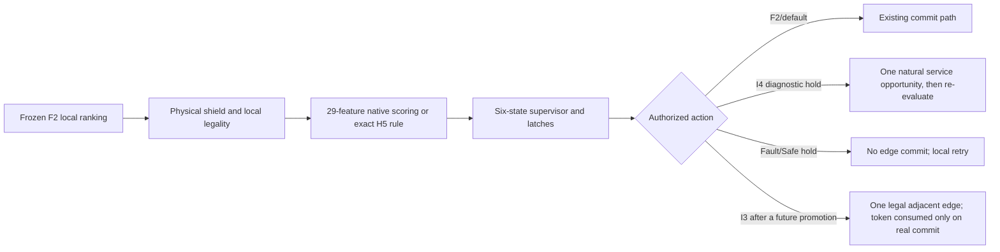

# G4IRSF16 native supervisor design

## Outcome

The runtime now has a native, bounded-local supervisor seam between frozen F2 selection and the existing merge/credit/edge commit machinery. It can run exact-off, action-inert shadow, or the exact H5 diagnostic closed-loop canary without a Python callback per decision.

The scientific deployment decision remains conservative:

- H0/F2 is the selected default.
- Learned I3 and I4 action changes are **not** authorized because `artifacts/gates/g4irsf16_offline_model_gate.json` is `CAUSAL_LEARNING_MODEL_NO_GO`.
- A learned model may be inspected in shadow, where it is explicitly diagnostic-only and cannot alter an action.
- Closed-loop learned-model loading fails closed. The only current closed-loop extension is the exact, digest-locked H5 neutral-action canary, marked `8192_DIAGNOSTIC_ONLY_NOT_PROMOTED`.

The machine-readable contract is `artifacts/policies/g4irsf16_supervisor_contract.json`.

## Decision path



No branch performs A*, scans the global reservation table, reads a future route/schedule, or calls back into Python. The inputs are the current node, already materialized one-hop candidates, bounded bag history, local queue/calendar scalars, and static potential.

## State and action contract

The native state space is:

- `F2_NORMAL`
- `I4_SELECTIVE_HOLD`
- `I3_RARE_OVERRIDE`
- `PIBT_RECOVERY`
- `SAFE_HOLD`
- `FAULT_RECOVERY`

The supervisor emits a prepared action token. I4 consumes at most one natural hold for a `(node, generation)` pair; the following local wakeup re-evaluates the same generation and therefore cannot chain arbitrary holds. I3 has a one-override-per-segment latch and a reverse-edge oscillation guard. A destination-merge request is counted as I3 applied only when a genuinely new pending request is committed; an existing request, rejected request, or failed credit bind does not inflate applied/action-change telemetry.

PIBT remains strict-local and is not triggered by a model abstention. Full A* fallback is forbidden by contract.

## Feature and fault ownership

Native inference mirrors the frozen 29-field ordered schema. `downstream_pressure` and `has_physical_fault` were removed because no exact deployment-time equivalents existed. Physical fault state is intentionally not a learned input: the non-configurable physical shield and supervisor own it.

Fault generation is maintained in a dedicated per-bag monotonic store. It is separate from `fault_priority_generation`, which is a one-successful-edge repair-priority token and must reset after use. Reusing that resettable token as a supervisor generation would make every later decision stale. A real `0->6` fault/repair regression now verifies that the repaired bag returns to normal supervisor decisions over later nodes.

In closed loop, `FaultHold` and `SafeHold` explicitly clear any tentative selected edge before commit. The fail-closed supervisor result is no longer advisory telemetry.

## Authorization boundary

A self SHA proves artifact integrity only; it cannot authorize its own promotion. The central runtime validator rejects learned-model closed loop while the offline gate is NO_GO, covering direct C++, pybind, and Python-wrapper entry paths. Model shadow reports:

```text
policy_kind = unpromoted_model_shadow
diagnostic_only = true
promotion_authorized = false
action_change_count = 0
```

The H5 rule is a separate exact contract. Its three thresholds, rule identity, action, authorization string, and self digest are hard-locked. H5 exercises real latches and commit timing, but its neutral causal evidence does not become a performance or learning claim.

## Closed-loop evidence

Formal performance uses raw-bag original-entry TTH, not per-segment `finish-release`. The runner aggregates protected segments by raw task and reports original-entry mean/p95/p99 plus source/network decomposition. Segment-paired TTH remains diagnostic.

| Segments | H5 applied action changes | Raw-bag p95 delta vs off | Raw-bag p99 delta vs off | Safety | Notes |
|---:|---:|---:|---:|:---:|---|
| 144 | 19 | 0 s | 0 s | PASS | Re-run with the final supervisor binary |
| 512 | 102 | 0 s | 0 s | PASS | Native run existed; gates reconciled without rerun |
| 2,048 | 515 | 0 s | 0 s | PASS | 2,179 bounded lifecycle rows dropped |
| 8,192 | 1,865 | 0 s | 0 s | PASS | 1,230 post-commit rollbacks exactly match 1,230 queue-capacity blocks |

The early guards are p95 no worse than off +2 s and p99 no worse than off +4 s. All four ladders pass. These results validate runtime plumbing and safety under an action-changing diagnostic canary; they do not show H5 utility.

The 2,048/8,192 gate status was reconciled from the already-generated native summaries, activation traces, and raw-bag timing outputs after correcting two evidence semantics. Native execution was not repeated and no runtime counter or timing value was modified:

1. a bounded merge lifecycle log may truncate without violating live grant conservation;
2. post-commit rollback is the legal queue-capacity compensation path and must match the capacity-block count, not equal zero.

Each official metadata file records `evidence_reconciliation.native_runtime_reexecuted=false`. External binary paths are published as `EXTERNAL_NATIVE_BINARY` with the original filename and SHA, so the evidence contains no machine-local temporary path.

## Scaling implications and next ideas

The implementation separates bounded observability from correctness. A capped audit log may truncate at larger ladders; safety is decided from live conservation, active-grant bijection, exact-slot ownership, zero final/outstanding grants, zero stale arbitration, and the capacity-compensation identity.

Two follow-up ideas are worth testing only after new causal support exists:

1. Replace fixed event-count lifecycle storage with sampled or chunked streaming evidence while keeping the current live counters authoritative. This improves audit completeness without expanding the decision state.
2. Treat an independently signed promotion manifest, not a model self hash, as the future authorization object. The manifest should bind the offline gate decision, allowed model digests, hook (`I3` or `I4`), feature schema, and closed-loop mode.

Until such evidence and authorization exist, the runtime correctly remains H0 by default, H5 diagnostic-only, and learned action changes fail-closed.
